# PEMROGRAMAN BERBASIS FRAMEWORK

## Jobsheet 01 - Setup Project Next.js Menggunakan Pages Router

------------------------------------------------------------------------

## Identitas Mahasiswa

-   **Nama:** Ghetsa Ramadhani Riska A.
-   **Kelas:** TI-2D
-   **No Absen:** 11
-   **NIM:** 2341720004
-   **Program Studi:** Teknik Informatika
-   **Jurusan:** Teknologi Informasi
-   **Politeknik Negeri Malang**
-   **Tahun:** 2026

------------------------------------------------------------------------

# D. Langkah Kerja Praktikum

## Langkah 1 -- Pengecekan Lingkungan

Buka terminal / command prompt dan jalankan:

``` bash
node -v
npm -v
git -v

```


Tujuan: Memastikan Node.js, npm, dan Git sudah terinstal dengan benar.

------------------------------------------------------------------------

## Langkah 2 -- Membuat Project Next.js

1.  Buat direktori baru dan masuk ke direktori kerja.
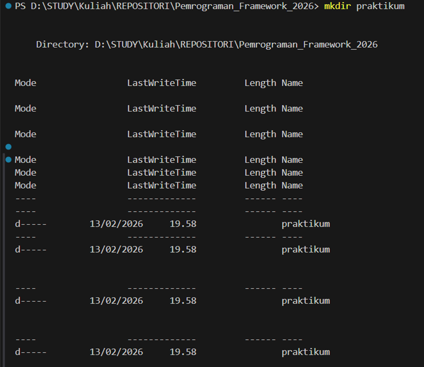
2.  Jalankan perintah:
``` bash
npx create-next-app@13.4.7
```
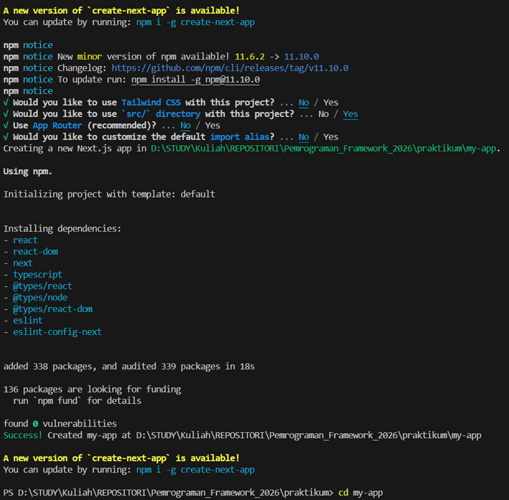
3.  Masuk ke folder project:

``` bash
cd my-app
```

4.  Tunggu proses instalasi selesai.

------------------------------------------------------------------------

## Langkah 3 -- Menjalankan Server Development

Jalankan aplikasi dengan:

``` bash
npm run dev
```
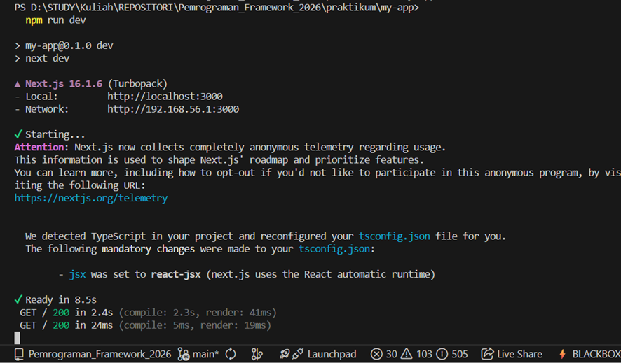
Buka browser dan akses:

    http://localhost:3000
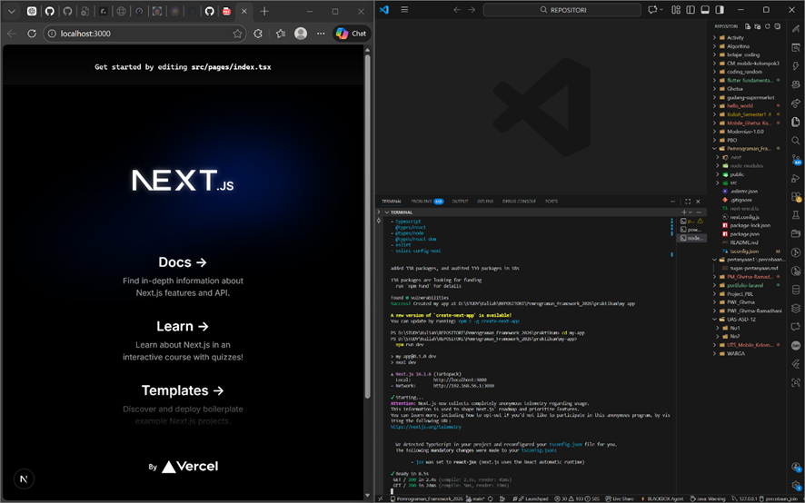
------------------------------------------------------------------------

## Langkah 4 -- Mengenal Struktur Folder

Beberapa folder penting:

-   `pages/` → Tempat routing halaman 
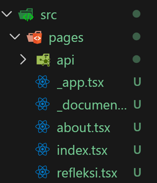
-   `public/` → Aset statis 

-   `styles/` → File CSS 
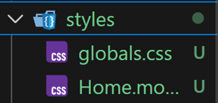
-   `package.json` → Konfigurasi project 
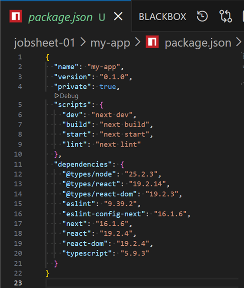
-   `.gitignore` → File yang tidak di-track Git 
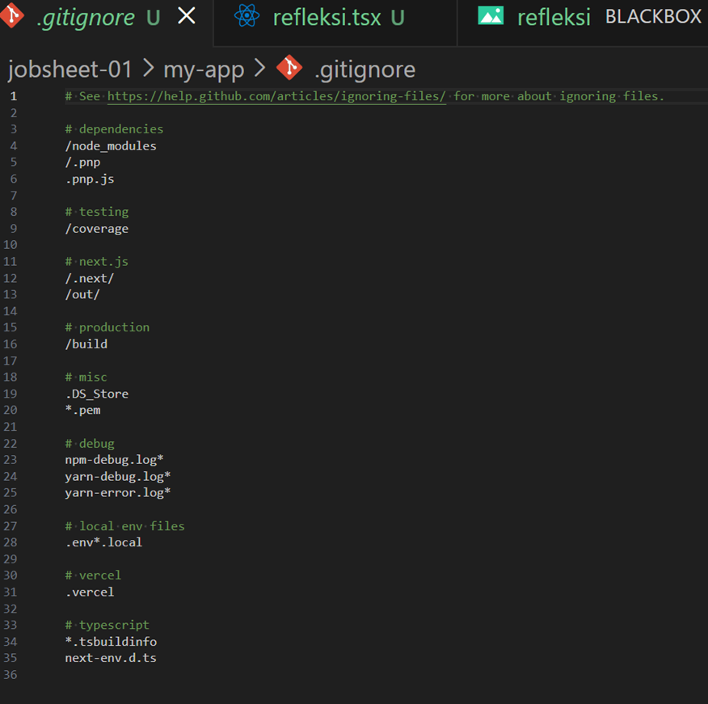

------------------------------------------------------------------------

## Langkah 5 -- Modifikasi Halaman Utama

Buka file:

    pages/index.js

Ubah isi halaman sesuai kebutuhan, lalu simpan dan lihat perubahan di
browser.
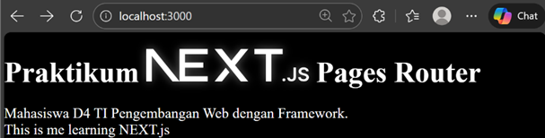
------------------------------------------------------------------------

## Langkah 6 -- Modifikasi API

1.  Buka folder:

```
    pages/api
```

2.  Modifikasi file `hello.ts` 

3.  Akses melalui browser:
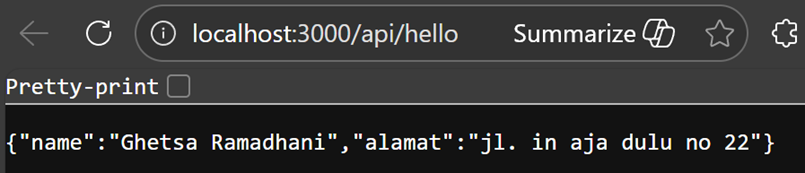

```
    http://localhost:3000/api/hello
```

Tambahkan extension JSON Formatter pada Chrome agar tampilan JSON lebih
rapi.

------------------------------------------------------------------------

## Langkah 7 -- Modifikasi Background

1.  Buka file:

```
    _app.tsx
```
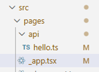
2.  Modifikasi sesuai kebutuhan.

3.  Jalankan kembali localhost dan lihat perubahan.

------------------------------------------------------------------------

# E. Tugas Praktikum

## Tugas 1 (Wajib)

-   Buat halaman baru `about.js` di folder `pages`
-   Tampilkan:
    -   Nama Mahasiswa
    -   NIM
    -   Program Studi


------------------------------------------------------------------------

## Tugas 2 (Pengayaan)

Tambahkan minimal 1 link navigasi dari halaman utama ke halaman `about`.

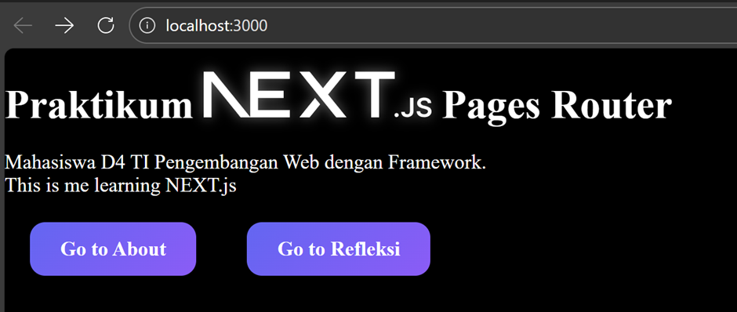
------------------------------------------------------------------------

# F. Pertanyaan Refleksi

### 1. Mengapa Pages Router disebut sebagai routing berbasis file?

Karena Next.js menggunakan struktur file di dalam folder `pages` untuk
menentukan URL secara otomatis. Setiap file yang dibuat langsung menjadi
route.


### 2. Apa perbedaan Next.js dengan React standar (CRA)?

Next.js memiliki fitur bawaan seperti routing otomatis, Server-Side
Rendering (SSR), Static Site Generation (SSG), dan optimasi gambar.\
Sedangkan React standar (Create React App) hanya menyediakan dasar React
tanpa fitur tambahan tersebut.


### 3. Apa fungsi perintah `npm run dev`?

Digunakan untuk menjalankan aplikasi dalam mode development dengan fitur
hot reload.


### 4. Apa perbedaan `npm run dev` dan `npm run build`?

-   `npm run dev` → Mode development (hot reload & debugging).\
-   `npm run build` → Membuat versi production yang sudah dioptimasi dan
    siap deployment.


------------------------------------------------------------------------

#  Kesimpulan

Pada praktikum ini dilakukan setup project Next.js menggunakan Pages
Router, menjalankan development server, memahami struktur folder,
memodifikasi halaman dan API, serta membuat halaman tambahan dengan
navigasi.

Project berhasil dijalankan dan dikembangkan sesuai instruksi jobsheet.
