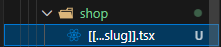
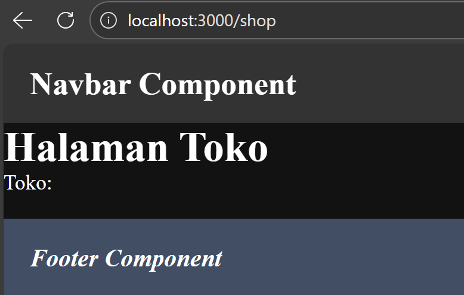
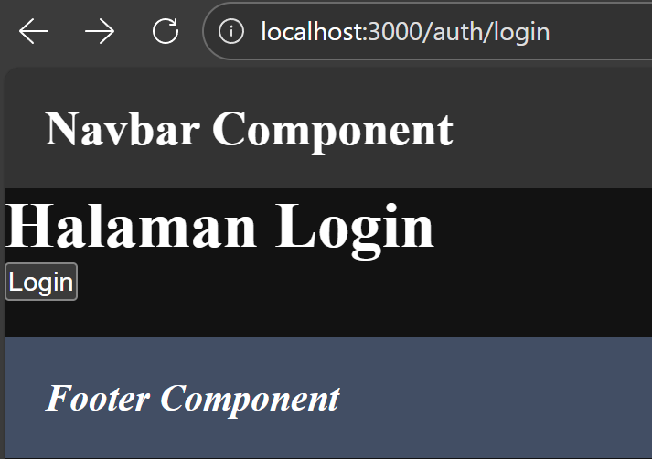
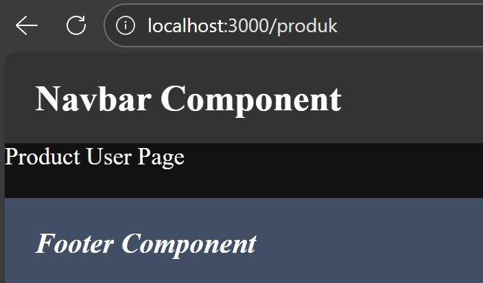

# PEMROGRAMAN BERBASIS FRAMEWORK

## JOBSHEET 03

### Catch-All Routing, Optional Catch-All, Linking & Navigating pada Next.js (Pages Router)

------------------------------------------------------------------------

## 👤 Identitas Mahasiswa

-   **Nama:** Ghetsa Ramadhani Riska A.
-   **Kelas:** TI-3D
-   **No. Absen:** 11
-   **NIM:** 2341720004
-   **Program Studi:** Teknik Informatika
-   **Jurusan:** Teknologi Informasi
-   **Politeknik Negeri Malang**
-   **Tahun:** 2026

------------------------------------------------------------------------

# A. Tujuan Praktikum

Setelah menyelesaikan praktikum ini, mahasiswa mampu:

1.  Membuat catch-all route untuk menangkap banyak segmen URL.
2.  Menggunakan optional catch-all route agar halaman tetap dapat
    diakses tanpa parameter.
3.  Mengambil parameter URL berbentuk array menggunakan useRouter.
4.  Menerapkan navigasi antar halaman menggunakan Link.
5.  Melakukan navigasi imperatif menggunakan router.push().
6.  Mengimplementasikan redirect sederhana berbasis kondisi (simulasi
    login).

------------------------------------------------------------------------

# B. Dasar Teori Singkat

## 1. Segment & Slug pada URL

URL dapat terdiri dari beberapa segmen, contoh:

    /product/clothes/tops/t-shirt

Setiap bagian dipisahkan oleh `/` dan disebut segmen.

## 2. Catch-All Route

Next.js memungkinkan menangkap semua segmen URL menggunakan:

    [...slug].js

Hasil parameter akan berbentuk array.

## 3. Optional Catch-All Route

Agar halaman tetap bisa diakses meskipun tanpa parameter:

    [[...slug]].js

## 4. Navigasi di Next.js

-   Deklaratif: `Link` dari `next/link`
-   Imperatif: `router.push()` dari `next/router`

------------------------------------------------------------------------

# C. Alat dan Bahan

## Perangkat Lunak

-   Node.js (LTS)
-   NPM
-   Visual Studio Code
-   Browser (Chrome / Firefox)

## Prasyarat

-   Project Next.js Pages Router sudah tersedia
-   Server dapat dijalankan (`npm run dev`)

------------------------------------------------------------------------

# D. Langkah Kerja Praktikum

## Langkah 1 -- Menjalankan Project

``` bash
npm run dev
```

Akses:

    http://localhost:3000

------------------------------------------------------------------------

## Langkah 2 -- Membuat Catch-All Route

### Struktur Folder

    pages/
     └── shop/
         └── [...slug].tsx

### Kode Awal

``` tsx
import { useRouter } from "next/router";

const HalamanToko = () => {
  const router = useRouter();
  console.log(router);

  return (
    <div>
      <h1>Halaman Toko</h1>
    </div>
  );
};

export default HalamanToko;
```

<br>

#### Output awal:


Cek menggunakan `console.log` apakah nilai segment berhasil didapat.

### Modifikasi untuk menampilkan query

``` tsx
import { useRouter } from "next/router";

const halamanToko = () => {
  const { query } = useRouter();
  return (
    <div>
      <h1>Halaman Toko</h1>
      <p>Toko: {`${query.slug && query.slug[0]+"-"+ query.slug[1]}`}</p>  
    </div>
  );
};

export default halamanToko;

```
#### Output setelah:


------------------------------------------------------------------------

## Langkah 3 -- Pengujian Catch-All Route

Akses URL berikut:

- /shop/clothes <br>


- /shop/clothes/tops  <br>


- /shop/clothes/tops/t-shirt  <br>


Perhatikan bahwa:

-   `slug` berbentuk array
-   Isi halaman berubah sesuai URL

Jika hanya membaca `array[0]` dan `array[1]`, maka segmen lebih dari dua
akan `undefined`.

Solusi:

Gunakan:

``` tsx
Array.isArray(query.slug) ? query.slug.join("-") : query.slug
```

Sekarang berapapun banyaknya segmen tetap terbaca. <br>


------------------------------------------------------------------------

## Langkah 4 -- Optional Catch-All Route

Jika menggunakan:

    [...slug].js

Maka saat mengakses:

    /shop

Akan terjadi error. <br>


### Solusi

Rename file:

    [...slug].js → [[...slug]].js

 <br>
Sekarang halaman dapat diakses meskipun tanpa parameter.<br>

------------------------------------------------------------------------

## Langkah 5 -- Validasi Parameter

Tambahkan validasi agar tidak error saat slug kosong:

``` tsx
<p>
  Kategori: {query.slug ? query.slug[0] : "Semua Kategori"}
</p>
```

Output: <br>
  

------------------------------------------------------------------------

## Langkah 6 -- Membuat Halaman Login & Register

### Struktur

    pages/
     └── auth/
         ├── login.tsx
         └── register.tsx

### login.tsx

``` tsx
import Link from "next/link";

const HalamanLogin = () => {
  return (
    <div>
      <h1>Halaman Login</h1>
      <Link href="/auth/register">Ke Halaman Register</Link>
    </div>
  );
};

export default HalamanLogin;
```

### register.tsx

``` tsx
import Link from "next/link";

const HalamanRegister = () => {
  return (
    <div>
      <h1>Halaman Register</h1>
      <Link href="/auth/login">Ke Halaman Login</Link>
    </div>
  );
};

export default HalamanRegister;
```

------------------------------------------------------------------------

## Langkah 7 -- Navigasi Imperatif (router.push)

Tambahkan button login:

``` tsx
import { useRouter } from "next/router";

const HalamanLogin = () => {
  const { push } = useRouter();

  const handlerLogin = () => {
    push("/produk");
  };

  return (
    <div>
      <h1>Halaman Login</h1>
      <button onClick={() => handlerLogin()}>
        Login
      </button>
    </div>
  );
};
export default HalamanLogin;
```

Gunakan:

    onClick={() => handlerLogin()}

Klik tombol dan perhatikan perpindahan halaman tanpa reload.

------------------------------------------------------------------------

## Langkah 8 -- Simulasi Redirect (Belum Login)

### pages/produk/index.tsx

``` tsx
import { useRouter } from "next/router";
import { useEffect, useState } from "react";

const Produk = () => {
  const [isLogin, setIsLogin] = useState(false);
  const { push } = useRouter();

  useEffect(() => {
    if (!isLogin) {
      push("/auth/login");
    }
  }, []);

  return <div>Produk User Page</div>;
};

export default Produk;
```

Jika akses `/produk` → otomatis diarahkan ke login.

------------------------------------------------------------------------

# E. Tugas Praktikum

## Tugas 1 (Wajib)

Buat catch-all route:

    /category/[...slug].js

Tampilkan seluruh parameter URL dalam bentuk list.

### Jawaban:
#### 1. Kode

```tsx
import { useRouter } from "next/router";

const halamanKategori = () => {
  const router = useRouter();

  if (!router.isReady) return <p>Loading...</p>;

  const { slug } = router.query;

  return (
    <div>
      <h1>Halaman Kategori</h1>

      <p>
        Nilai slug: {Array.isArray(slug) ? slug.join("-") : slug}
      </p>
      <br />
      <h3>List Kategori</h3>
      {Array.isArray(slug) && (
        <ol style={{ listStyleType: "decimal", paddingLeft: "20px" }}>
          {slug.map((item, index) => (
            <li key={index}>{item}</li>
          ))}
        </ol>
      )}
    </div>
  );
}

export default halamanKategori;
```

#### 2. Struktur

    pages/
     └── category/
         └── [[...slug]].tsx

#### 3. Output


## Tugas 2 (Wajib)

Buat navigasi:

-   Login → Product (imperatif)
-   Login ↔ Register (Link)


### Jawaban: 
- Link Daftar telah berhasil mengarahkan ke halaman Register
- Berhasil melakukan pengecekan sederhana untuk login dan register (belum terhubung ke database). Hanya mengecek telah diisi atau belum.
- Ketika email dan password diisi dan menekan login, akan mengarahkan ke halaman produk.
- Jika di refresh halaman akan tetap dan dianggap tetap login.

#### Output

  

## Tugas 3 (Pengayaan)

Terapkan redirect otomatis ke login jika user belum login.

### Jawaban:
#### 1. Kode
produk/index.tsx
```tsx
import { useRouter } from "next/router";
import { useEffect, useState } from "react";

const Produk = () => {
  const [isChecking, setIsChecking] = useState(true);
  const [isLogin, setIsLogin] = useState(false);
  const { push } = useRouter();
  useEffect(() => {
    const status = localStorage.getItem("isLogin");

    if (status === "true") {
      setIsLogin(true);
      setIsChecking(false);
    } else {
      push("/auth/login");
      setIsChecking(false);
    }
  }, []);

  if (isChecking) {
    return <div>Loading...</div>;
  }
  if (!isLogin) {
    return null;
  }
  return <div>Produk User Page</div>;

};

export default Produk;
```

Pengecekan di login.tsx

```tsx
  ...
  const handlerLogin = (e: React.FormEvent) => {
    e.preventDefault();
    // Simple validation
    if (email && password) {
      localStorage.setItem("isLogin", "true");
      push("/produk");
    }
  };
  ...
```
#### 2. Output
- Jika user belum login akan terlempar balik ke login <br>
  
- Jika sudah login akan secara langsung mengarahkan ke halaman produk <br>
  
------------------------------------------------------------------------

# F. Pertanyaan Evaluasi

### 1. Apa perbedaan `[id].js` dan `[...slug].js`?

`[id].js` menangkap satu parameter saja, sedangkan `[...slug].js`
menangkap banyak segmen dalam bentuk array.

### 2. Mengapa slug berbentuk array?

Karena catch-all route menangkap lebih dari satu segmen URL.

### 3. Kapan menggunakan Link dan router.push()?

`Link` untuk navigasi deklaratif, `router.push()` untuk navigasi
berbasis aksi/logic.

### 4. Mengapa navigasi Next.js tidak me-refresh halaman?

Karena menggunakan client-side navigation (SPA behavior).

------------------------------------------------------------------------

# G. Kesimpulan

Praktikum ini membahas implementasi Catch-All Routing, Optional
Catch-All, serta navigasi deklaratif dan imperatif pada Next.js Pages
Router.

Mahasiswa memahami cara menangkap banyak segmen URL dalam bentuk array,
mengimplementasikan navigasi tanpa reload halaman, serta membuat
simulasi redirect berbasis kondisi login.