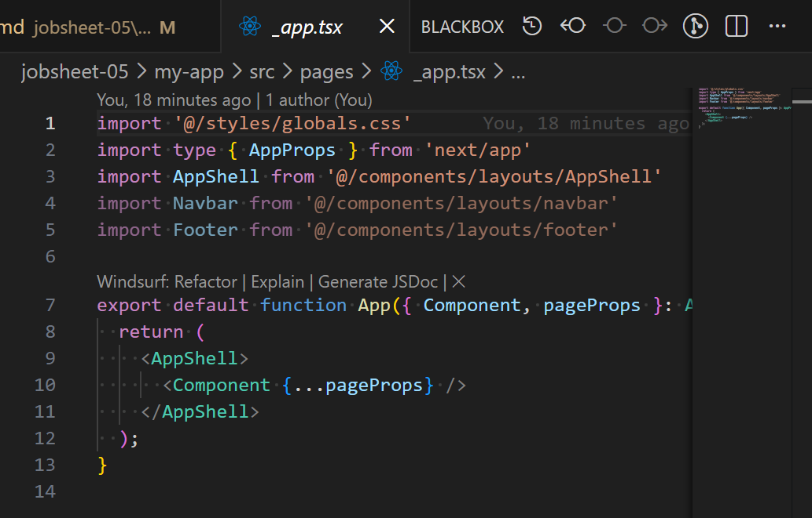
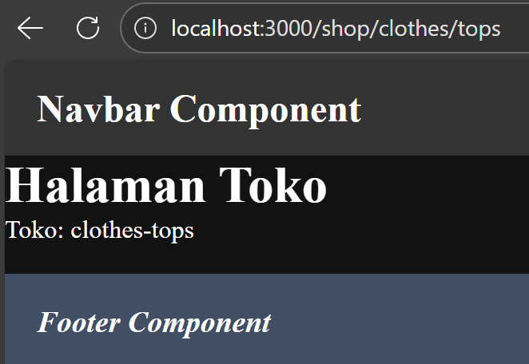
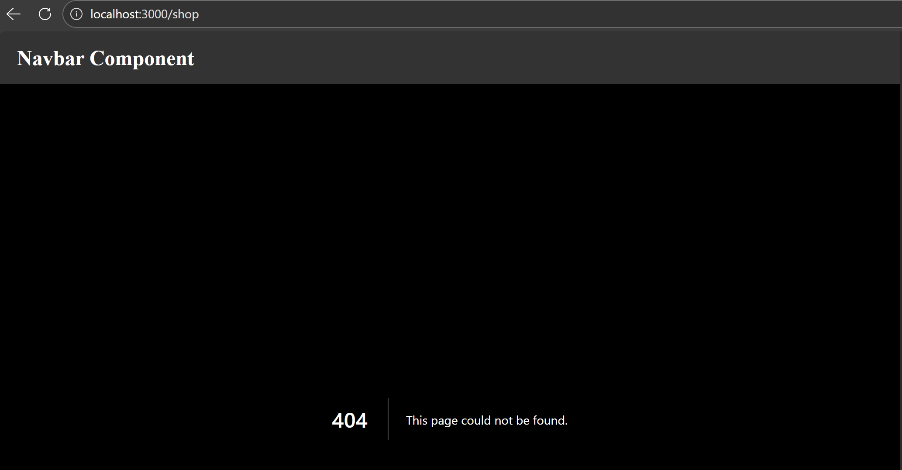
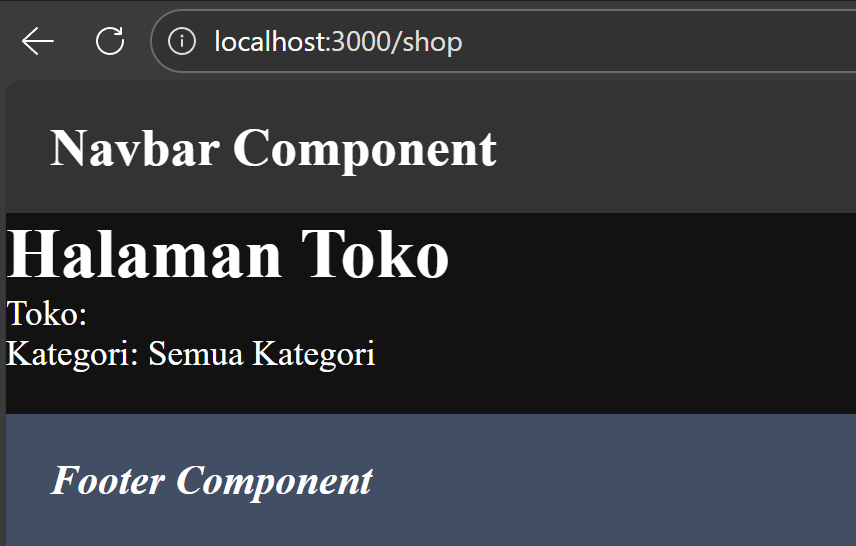
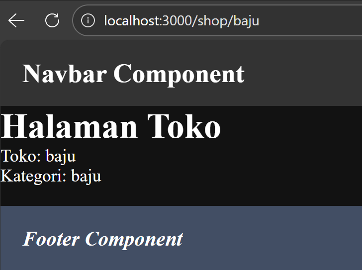
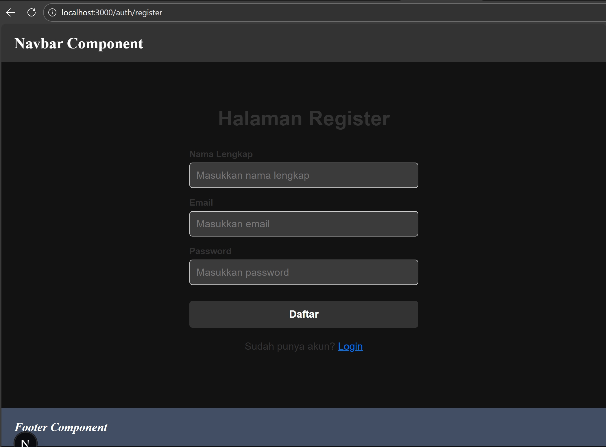
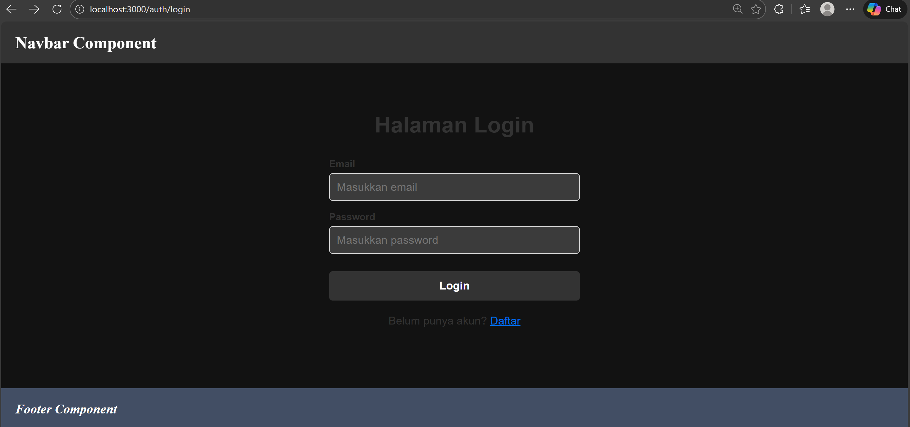

# PEMROGRAMAN BERBASIS FRAMEWORK

## JOBSHEET 05

### Styling pada Next.js (Global CSS, CSS Module, Inline Style, SCSS, dan Tailwind CSS)

---

## 👤 Identitas Mahasiswa

* **Nama:** Ghetsa Ramadhani Riska A.
* **Kelas:** TI-3D
* **No. Absen:** 11
* **NIM:** 2341720004
* **Program Studi:** Teknik Informatika
* **Jurusan:** Teknologi Informasi
* **Politeknik Negeri Malang**
* **Tahun:** 2026

---

# A. Tujuan Praktikum

Setelah menyelesaikan praktikum ini, mahasiswa mampu:

1. Memahami berbagai pendekatan styling pada Next.js
2. Menggunakan Global CSS dan memahami cakupannya
3. Mengimplementasikan CSS Module (local scope)
4. Menggunakan Inline Styling (CSS-in-JS) pada JSX
5. Menggunakan SCSS (SASS) untuk manajemen style yang kompleks
6. Melakukan refactoring struktur folder agar project lebih maintainable
7. Mengintegrasikan Tailwind CSS pada Next.js Pages Router

---

# B. Dasar Teori Singkat

Next.js mendukung beberapa metode styling:

1. **Global CSS** → berlaku untuk seluruh aplikasi
2. **CSS Module** → memiliki scope lokal
3. **Inline Style (CSS-in-JS)** → styling langsung di dalam JSX
4. **SCSS / SASS** → mendukung variable & nested rule
5. **Tailwind CSS** → utility-first CSS framework

Pemilihan metode styling disesuaikan dengan kebutuhan dan skala project.

---

# C. Alat dan Bahan

## Perangkat Lunak

* Node.js (minimal v16)
* NPM
* Visual Studio Code
* Browser
* Project Next.js (Pages Router, TypeScript)

## Menjalankan Project

```bash
npm run dev
```

---

# D. Langkah Kerja Praktikum

---

## 1️⃣ Global CSS

### a. Membuat File Global CSS

Lokasi:

```
styles/globals.css
```

Isi contoh:

```css
* {
  box-sizing: border-box;
  padding: 0;
  margin: 0;
}

html,
body {
  max-width: 100vw;
  overflow-x: hidden;
}

a {
  color: inherit;
  text-decoration: none;
}
```

### b. Import Global CSS

Modifikasi pada:

```
pages/_app.tsx
```

```tsx
import "@/styles/globals.css";
```



### Catatan:

* Global CSS hanya bisa di-import di `_app.tsx`
* Berlaku untuk seluruh aplikasi

---

## 2️⃣ CSS Module (Local Scope)

### a. Struktur Komponen Navbar

```
src/components/layout/Navbar/
├── index.tsx
└── Navbar.module.css
```


---

### b. Modifikasi global.css

Tambahkan styling umum jika diperlukan.

---

### c. Modifikasi Navbar.module.css

```css
.navbar {
  width: 100%;
  height: 60px;
  background-color: #333;
  color: white;
  display: flex;
  align-items: center;
  padding: 0 20px;
}
```


---

### d. Modifikasi index.tsx pada folder Navbar

```tsx
import styles from "./Navbar.module.css";

const Navbar = () => {
  return (
    <div className={styles.navbar}>
      <h1>Navbar Component</h1>
    </div>
  );
};

export default Navbar;



```

### Keunggulan CSS Module

* Scope lokal
* Tidak bentrok antar class
* Cocok untuk komponen reusable

---

## 3️⃣ Styling untuk Pages (CSS Module)

### a. Tambahkan login.module.css pada folder auth

```
pages/auth/login.module.css
```

Isi contoh:

```css
.login {
  display: flex;
  flex-direction: column;
  justify-content: center;
  align-items: center;
  height: 100vh;
}
```

Kode:
login.module.css<br>


login.tsx<br>


Output:<br>


---

### b. Modifikasi login.tsx

Tambahkan:

```tsx
import styles from "./login.module.css";
```

Gunakan:

```tsx
<div className={styles.login}>
```

---

## 4️⃣ Conditional Rendering Navbar (Tanpa Navbar di Login)

Modifikasi pada:

```
src/components/layout/AppShell/index.tsx
```

Tambahkan:

```tsx
import { useRouter } from "next/router";

const disableNavbar = ["/auth/login", "/auth/register"];
const { pathname } = useRouter();

{!disableNavbar.includes(pathname) && <Navbar />}
```

Kode:<br>


Output:<br>


### Insight

* Gunakan `router.pathname`
* Jangan gunakan `asPath` jika ada query parameter

---

## 5️⃣ Refactoring Struktur Project (Best Practice)

### Struktur Awal

```
pages/login.tsx
styles/login.module.css
```

### Struktur Refactor

```
pages/auth/login.tsx
src/views/auth/Login/
├── index.tsx
└── Login.module.css
```

---

### Modifikasi:

1. Hapus `login.module.css` dari folder pages
2. Pindahkan ke `views/auth/Login/`
3. Modifikasi `pages/auth/login.tsx` agar hanya menjadi wrapper
4. Modifikasi `views/auth/Login/index.tsx`

Contoh:

```tsx
const HalamanLogin = () => {
  return <TampilanLogin />;
};
```

Manfaat:

* Routing tetap bersih
* Logic & UI terpisah
* Mudah dikembangkan

---

## 6️⃣ Inline Styling (CSS-in-JS)

Modifikasi pada:

```
views/auth/Login/index.tsx
```

Tambahkan:

```tsx
<h1 style={{ 
  color: "red",
  borderRadius: "10px",
  padding: "10px"
}}>
  Halaman Login
</h1>
```

Kode:<br>


Output:<br>


### Catatan:

* Gunakan camelCase (`borderRadius`)
* Cocok untuk styling kecil & dinamis
* Tidak disarankan untuk layout besar

---

## 7️⃣ Kombinasi Global CSS + CSS Module

### Modifikasi global.css

Tambahkan:

```css
.big {
  font-size: 1.5rem;
}
```


### Modifikasi Navbar

```tsx
<div className="big">Navbar</div>
```

Kode: <br>


Kesimpulan:

* Global → utility umum
* Module → styling spesifik komponen

---

## 8️⃣ SCSS (SASS)

### a. Install SASS

```bash
npm install --save-dev sass
```


Cek pada `package.json`. <br>

---

### b. Tambahkan colors.scss

```
styles/colors.scss
```

```scss
$schema: (
  color-primary: #3498db,
  color-secondary: #2ecc71,
  color-accent: #e74c3c,
  color-background: #ecf0f1,
  color-text: #2c3e50,
);
```

---

### c. Gunakan di Module

Tambahkan:

```
views/auth/Login/login.module.scss
```

Import:

```tsx
import styles from "./login.module.scss";
```

Isi file SCSS:

```scss
@import "@/styles/colors.scss";

.login {
  display: flex;
  flex-direction: column;
  justify-content: center;
  align-items: center;
  height: 100vh;
  background-color: map-get($map: $schema, $key: color-secondary);
}
```

Kode:<br>


Output: <br>


### Keunggulan SCSS

* Variable
* Nested rule
* Maintainable untuk project besar

---

## 9️⃣ Tailwind CSS

### a. Install

```bash
npm install -D tailwindcss@3 postcss autoprefixer
npx tailwindcss init -p
```


---

### b. Konfigurasi tailwind.config.js

Tambahkan path:

```js
content: [
  "./pages/**/*.{js,ts,jsx,tsx,mdx}",
  "./components/**/*.{js,ts,jsx,tsx,mdx}",
  "./src/**/*.{js,ts,jsx,tsx,mdx}",
],
```



---

### c. Import di Global CSS

```css
@tailwind base;
@tailwind components;
@tailwind utilities;
```


---

### d. Contoh Penggunaan

Modifikasi pada:

```
views/auth/Login/index.tsx
```

```tsx
<h1 className="text-3xl font-bold text-blue-600 text-center">
  Halaman Login
</h1>
```

Kode: <br>


Output: <br>


---

# E. Tugas Praktikum

## Tugas 1

Buat halaman Register menggunakan CSS Module.

JAWABAN:
### Struktur


### Kode
<br>


### Output


## Tugas 2

Refactor halaman Produk ke folder views dan pisahkan:

* Hero Section
* Main Section

## Tugas 3

Terapkan Tailwind CSS dengan minimal 5 utility class.

---

# F. Pertanyaan Refleksi

1. CSS Module digunakan saat styling spesifik komponen dan menghindari konflik class.
2. Inline styling sulit di-maintain untuk project besar.
3. SCSS cocok untuk project besar karena mendukung variable & nested rule.
4. Tailwind lebih cepat dan konsisten dibanding CSS tradisional.

---

# G. Kesimpulan

Next.js memberikan fleksibilitas penuh dalam styling:

* Global CSS → utility umum
* CSS Module → komponen
* Inline Style → dinamis
* SCSS → scalable
* Tailwind CSS → cepat & konsisten

Pemilihan teknik styling harus disesuaikan dengan skala dan kebutuhan project.
