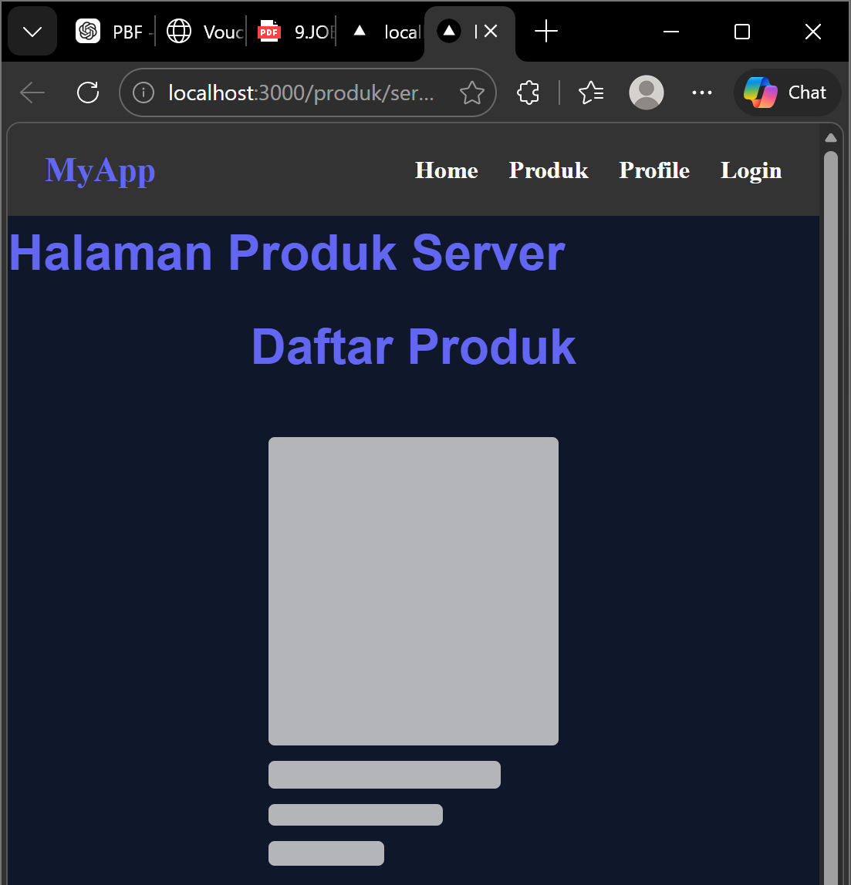

# PEMROGRAMAN BERBASIS FRAMEWORK

## JOBSHEET 09

### Server Side Rendering (SSR) pada Next.js

---

## 👤 Identitas Mahasiswa

* **Nama:** Ghetsa Ramadhani Riska A.
* **Kelas:** TI-3D
* **No. Absen:** 10
* **Program Studi:** Teknik Informatika
* **Jurusan:** Teknologi Informasi
* **Politeknik Negeri Malang**
* **Tahun:** 2026

---

# A. Tujuan Praktikum

Setelah menyelesaikan praktikum ini, mahasiswa mampu:

1. Menjelaskan konsep Server Side Rendering (SSR)
2. Membedakan SSR dengan Client Side Rendering (CSR)
3. Mengimplementasikan `getServerSideProps`
4. Mengelola data melalui props pada SSR
5. Menganalisis perbedaan performa SSR dan CSR melalui DevTools

---

# B. Dasar Teori Singkat

## 1️⃣ Konsep Server Side Rendering (SSR)

Server Side Rendering adalah proses rendering HTML yang dilakukan di server sebelum dikirim ke browser.

Alur SSR:

User Request
↓
Server fetch data
↓
Server generate HTML lengkap
↓
HTML dikirim ke browser
↓
React melakukan hydration

Karakteristik SSR:

* HTML sudah lengkap saat diterima client
* Tidak ada skeleton awal
* Cocok untuk SEO
* Data diambil setiap request

---

## 2️⃣ Perbedaan CSR dan SSR

| Aspek         | CSR                  | SSR                        |
| ------------- | -------------------- | -------------------------- |
| Rendering     | Client               | Server                     |
| Data Fetching | `useEffect`          | `getServerSideProps`       |
| Skeleton      | Perlu                | Tidak perlu                |
| SEO           | Kurang optimal       | Lebih optimal              |
| Network Tab   | Request API terlihat | Request API tidak terlihat |

---

# C. Langkah Kerja Praktikum

---

## Bagian 1 – Setup Halaman SSR

### 1️⃣ Buat file baru

Buat file berikut pada folder produk:

```tsx
pages/produk/server.tsx
```

### 2️⃣ Modifikasi file `server.tsx`

Isi awal file:

```tsx
import TampilProduk from "../views/produk";

const halamanProdukServer = () => {
  return (
    <div>
      <h1>Halaman Produk Server</h1>
      <TampilProduk products={[]} />
    </div>
  );
};

export default halamanProdukServer;
```

### 3️⃣ Jalankan browser

Akses:

```text
http://localhost:3000/produk/server
```



Pada tahap awal, halaman SSR sudah berhasil dibuat dan menampilkan komponen produk, tetapi data masih kosong sehingga yang tampil masih struktur awal halaman.

---

## Bagian 2 – Implementasi `getServerSideProps` pada `server.tsx`

Pada tahap ini, data produk diambil di server sebelum halaman dirender.

### 1️⃣ Tambahkan tipe data produk

```tsx
type ProductType = {
  id: string;
  name: string;
  price: number;
  image: string;
  category: string;
};
```

### 2️⃣ Modifikasi komponen halaman

```tsx
const halamanProdukServer = (props: { products: ProductType[] }) => {
  const { products } = props;

  return (
    <div>
      <h1>Halaman Produk Server</h1>
      <TampilProduk products={products} />
    </div>
  );
};
```

### 3️⃣ Tambahkan `getServerSideProps`

```tsx
export async function getServerSideProps() {
  const res = await fetch("http://localhost:3000/api/produk");
  const response = await res.json();

  return {
    props: {
      products: response.data,
    },
  };
}
```

### 4️⃣ Jalankan browser

Akses kembali:

```text
http://localhost:3000/produk/server
```

### Catatan penting

* Skeleton tidak muncul karena data sudah diambil di server
* Harus menggunakan **full URL**
* `getServerSideProps` dipanggil pada setiap request halaman

---

## Bagian 3 – Refactor Type (Product Type)

Agar tipe data lebih rapi dan dapat digunakan ulang, tipe produk dipindahkan ke file terpisah.

### 1️⃣ Buat folder dan file type

```tsx
pages/types/Product.type.ts
```

### 2️⃣ Modifikasi `Product.type.ts`

```tsx
export type ProductType = {
  id: string;
  name: string;
  price: number;
  image: string;
  category: string;
};
```

### 3️⃣ Modifikasi `server.tsx` agar menggunakan type terpisah

```tsx
import TampilProduk from "../views/produk";
import { ProductType } from "../types/Product.type";

const halamanProdukServer = (props: { products: ProductType[] }) => {
  const { products } = props;

  return (
    <div>
      <h1>Halaman Produk Server</h1>
      <TampilProduk products={products} />
    </div>
  );
};

export default halamanProdukServer;

export async function getServerSideProps() {
  const res = await fetch("http://localhost:3000/api/produk");
  const response = await res.json();

  return {
    props: {
      products: response.data,
    },
  };
}
```

Dengan refactor ini, tipe data produk menjadi lebih terpusat dan mudah digunakan di halaman lain.

---

## Bagian 4 – Uji Perbedaan SSR vs CSR

### Uji 1 – Skeleton

#### Pada halaman CSR

* Buka halaman CSR
* Refresh browser
* Skeleton muncul terlebih dahulu

#### Pada halaman SSR

* Buka halaman SSR
* Refresh browser
* Skeleton tidak muncul

---

### Uji 2 – Network Tab

1. Buka DevTools → **Network** → **XHR**
2. Refresh halaman CSR
   → Request API terlihat
3. Refresh halaman SSR
   → Request API tidak terlihat

---

### Uji 3 – Response HTML

#### CSR

HTML awal kosong atau hanya berisi skeleton.

#### SSR

HTML awal sudah berisi data produk lengkap.

---

# D. Tugas Praktikum

## Tugas Individu

### 1️⃣ Buat 2 halaman

* `/products` → CSR
* `/products/server` → SSR

### 2️⃣ Dokumentasikan

* Screenshot CSR
* Screenshot SSR
* Perbedaan Network tab
* Perbedaan View Source

### 3️⃣ Buat laporan analisis minimal 2 halaman

---

# E. Studi Analisis

### 1. Mengapa SSR lebih baik untuk SEO?

Karena pada SSR, HTML sudah lengkap dengan data saat pertama kali dikirim ke browser. Hal ini memudahkan mesin pencari membaca isi halaman tanpa harus menunggu JavaScript dijalankan.

### 2. Kapan sebaiknya menggunakan SSR?

SSR sebaiknya digunakan ketika halaman membutuhkan data yang selalu terbaru, membutuhkan SEO yang baik, atau perlu menampilkan konten lengkap sejak awal halaman dibuka.

### 3. Apa kekurangan SSR dibanding CSR?

SSR membebani server lebih besar karena proses render dilakukan setiap request. Selain itu, waktu respon server bisa lebih lama dibanding halaman statis atau CSR sederhana.

### 4. Mengapa skeleton tidak muncul pada SSR?

Karena data sudah diambil di server sebelum halaman dirender. Saat halaman sampai ke browser, data sudah siap ditampilkan sehingga tidak memerlukan loading state awal.

---

# F. Pertanyaan Evaluasi

### 1. Apa itu Server Side Rendering?

Server Side Rendering adalah proses rendering halaman di server sebelum dikirim ke browser.

### 2. Apa perbedaan utama SSR dan CSR?

Perbedaan utamanya terletak pada tempat render dan pengambilan data. CSR dilakukan di client menggunakan `useEffect`, sedangkan SSR dilakukan di server menggunakan `getServerSideProps`.

### 3. Mengapa SSR tidak menampilkan skeleton loading?

Karena data sudah tersedia saat HTML dikirim dari server.

### 4. Mengapa pada SSR request API tidak terlihat di tab XHR browser?

Karena proses fetch data dilakukan di server, bukan di browser.

---

# G. Kesimpulan

Pada praktikum ini telah dipelajari:

* Konsep Server Side Rendering pada Next.js
* Implementasi `getServerSideProps`
* Pengiriman data melalui props
* Refactor tipe data produk ke file terpisah
* Analisis perbedaan SSR dan CSR melalui skeleton, Network tab, dan response HTML

SSR sangat cocok digunakan untuk halaman yang membutuhkan SEO baik dan data yang selalu diperbarui. Dibanding CSR, SSR memberikan hasil HTML yang lebih lengkap sejak awal, meskipun proses render dilakukan di server pada setiap request.
