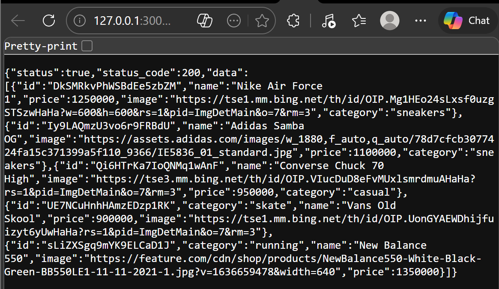
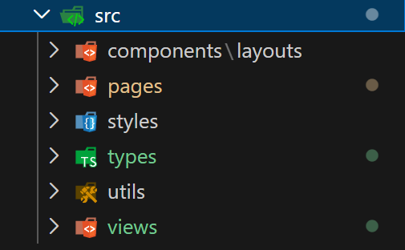
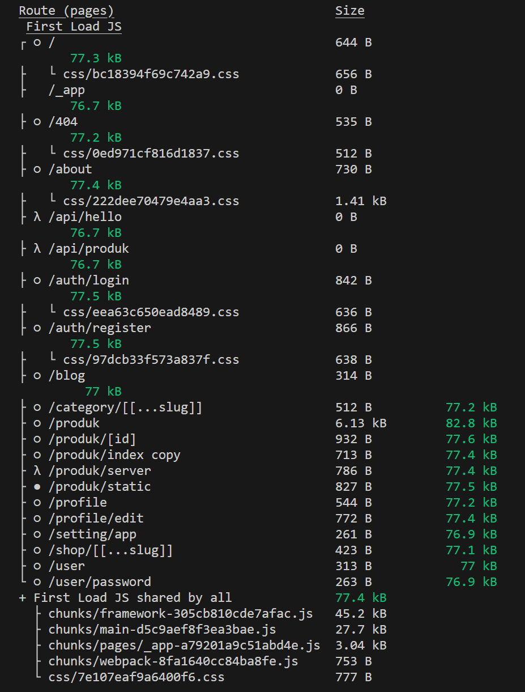
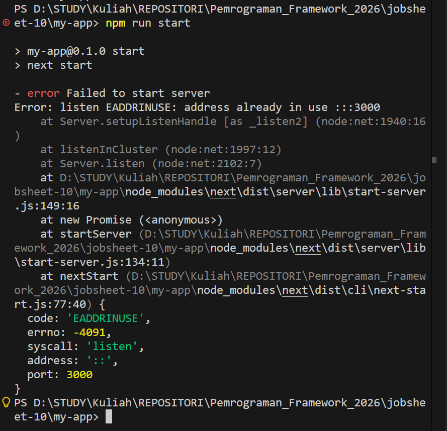
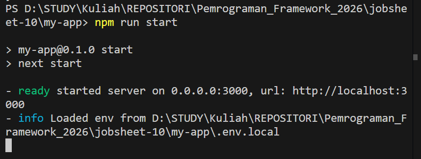
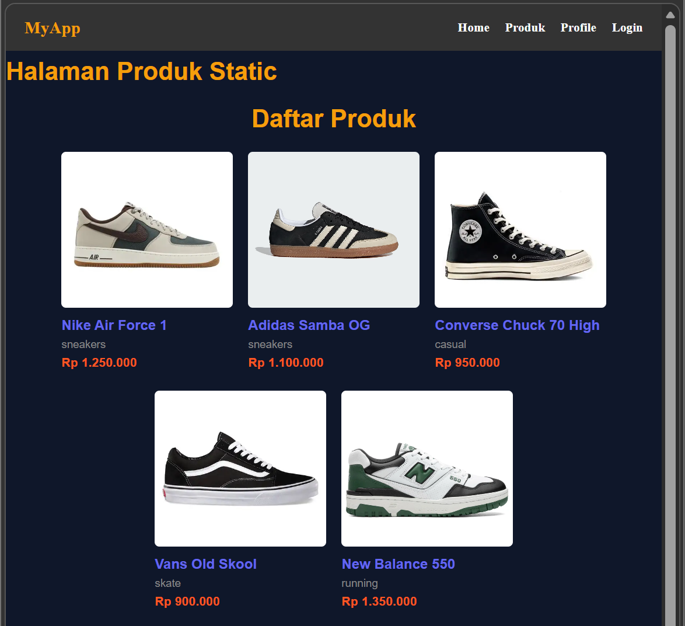
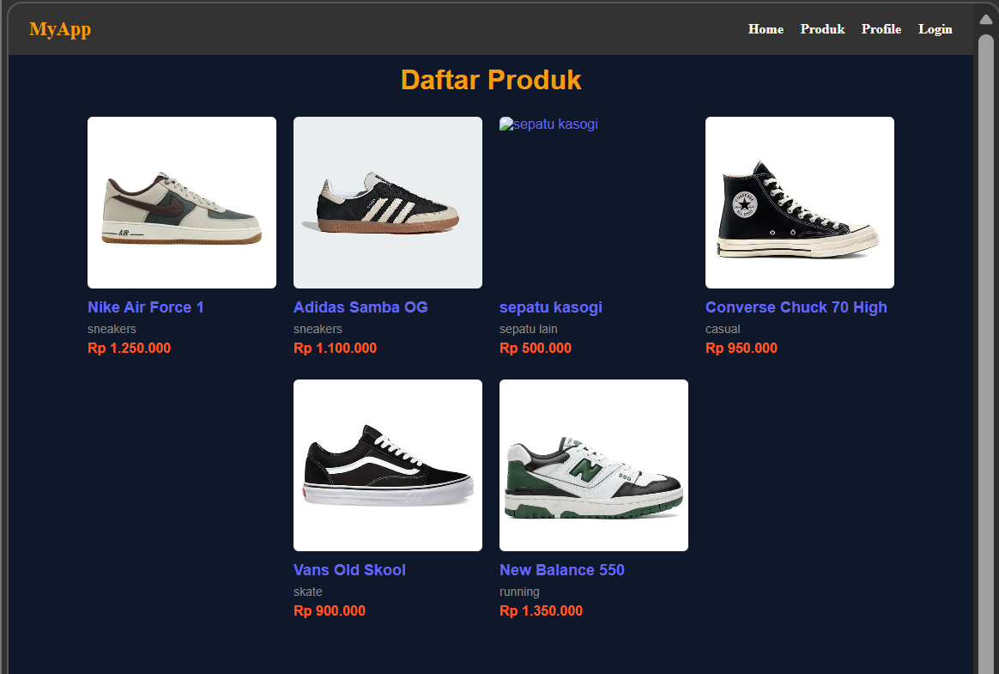
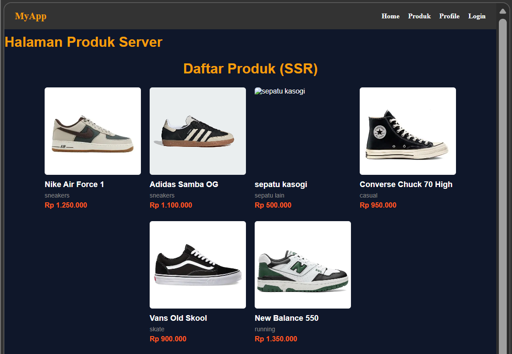
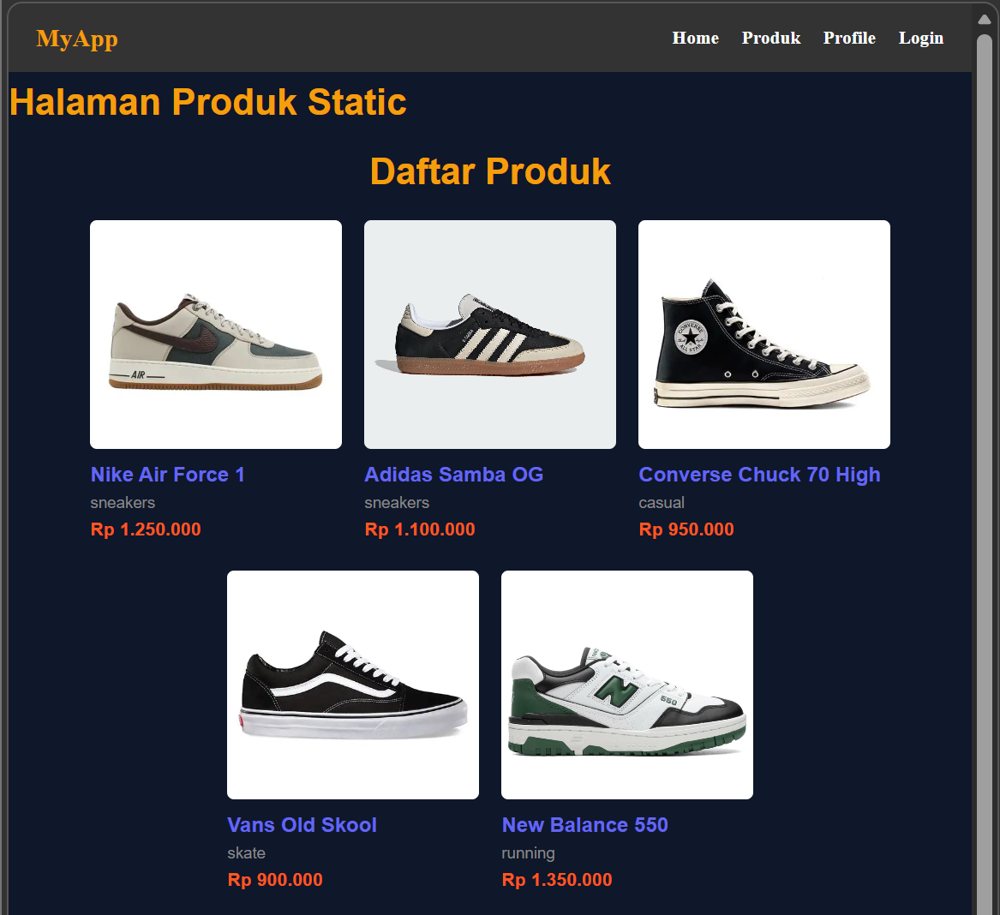
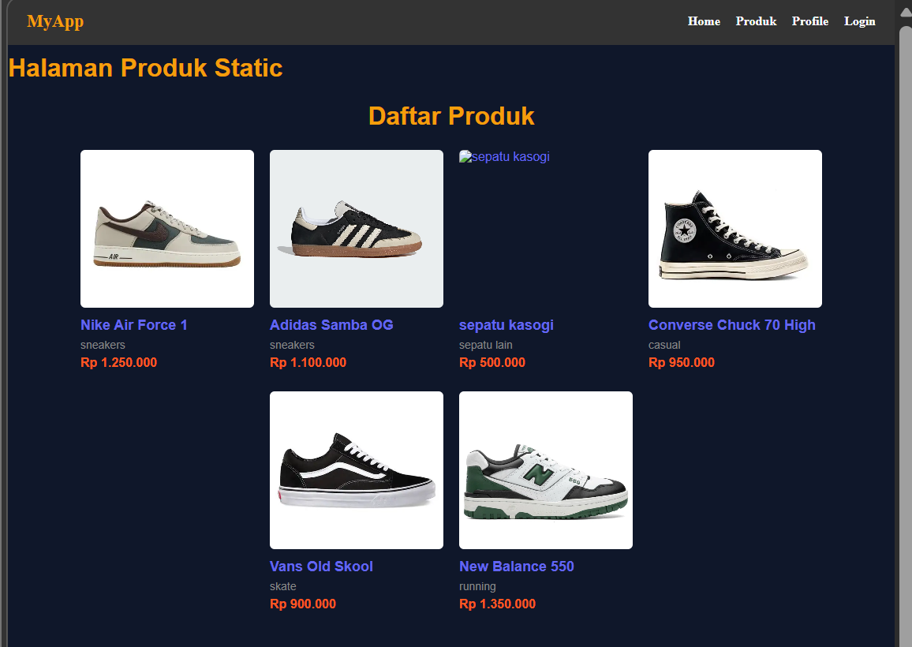

# PEMROGRAMAN BERBASIS FRAMEWORK

## JOBSHEET 10

### Static Site Generation (SSG) pada Next.js

---

## 👤 Identitas Mahasiswa

* **Nama:** Ghetsa Ramadhani Riska A.
* **Kelas:** TI-3D
* **No. Absen:** 11
* **NIM:** 2341720004
* **Program Studi:** Teknik Informatika
* **Jurusan:** Teknologi Informasi
* **Politeknik Negeri Malang**
* **Tahun:** 2026

---

# A. Tujuan Praktikum

Setelah menyelesaikan praktikum ini, mahasiswa mampu:

1. Menjelaskan konsep Static Site Generation (SSG)
2. Membedakan SSG dengan SSR dan CSR
3. Mengimplementasikan `getStaticProps`
4. Melakukan build dan menjalankan aplikasi pada production mode
5. Menganalisis perilaku data dinamis pada SSG

---

# B. Dasar Teori Singkat

## 1️⃣ Konsep Pre-rendering

Pre-rendering adalah proses:

* Mengambil data eksternal
* Mengubah kode menjadi HTML
* Mengirim HTML ke client
* React melakukan proses hydration di browser

Pada Next.js terdapat dua metode pre-rendering:

| Metode | Waktu Eksekusi  |
| ------ | --------------- |
| SSR    | Saat request    |
| SSG    | Saat build time |

---

## 2️⃣ Static Site Generation (SSG)

Static Site Generation adalah metode rendering dimana:

* HTML dibuat saat proses build
* Data diambil saat build
* Halaman menjadi file statis

Alur SSG:

```
npm run build
↓
Next.js mengambil data
↓
Generate HTML statis
↓
Disimpan sebagai file statis
↓
Dikirim ke browser saat request
```

Karakteristik SSG:

* Sangat cepat
* Cocok untuk landing page
* Tidak real-time
* Data berubah hanya setelah build ulang

---

## 3️⃣ Perbandingan CSR vs SSR vs SSG

| Aspek       | CSR       | SSR        | SSG          |
| ----------- | --------- | ---------- | ------------ |
| Waktu Fetch | Client    | Runtime    | Build Time   |
| Skeleton    | Ada       | Tidak      | Tidak        |
| Update Data | Real-time | Real-time  | Build ulang  |
| Cocok Untuk | Dashboard | E-commerce | Landing Page |

Tabel perbandingan ini juga ditampilkan pada diagram jobsheet halaman awal materi.

---

# C. Langkah Kerja Praktikum

---

# Bagian 1 – Setup Halaman Static

### 1️⃣ Membuat file halaman SSG

Buat file baru pada folder:

```
pages/produk/static.tsx
```

---

### 2️⃣ Modifikasi file `static.tsx`

Tambahkan kode berikut:

```tsx
import TampilProduk from "../../views/product";
import { ProductType } from "../../types/Product.type";

const halamanProdukStatic = (props: { products: ProductType[] }) => {
  const { products } = props;

  return (
    <div>
      <h1>Halaman Produk Static</h1>
      <TampilProduk products={products} />
    </div>
  );
};

export default halamanProdukStatic;
```

---

### 3️⃣ Implementasi `getStaticProps`

Tambahkan fungsi berikut pada file yang sama:

```tsx
export async function getStaticProps() {

  const res = await fetch("http://127.0.0.1:3000/api/produk");
  const response = await res.json();

  console.log("Data produk yang diambil dari API:", response);

  return {
    props: {
      products: response.data,
    },
  };
}
```



Catatan penting:

* Implementasi hampir sama dengan **SSR**
* Perbedaan hanya pada **method yang digunakan**

```
SSR → getServerSideProps
SSG → getStaticProps
```

---

# Bagian 2 – Build Production Mode

Langkah berikut digunakan untuk membuat halaman statis.

### 1️⃣ Pindahkan beberapa folder

Untuk menghindari error, beberapa folder dipindahkan ke luar folder `src/pages`.

Struktur folder menjadi:

```
src
 ├ components
 ├ pages
 ├ styles
 ├ types
 ├ utils
 └ views
```



Langkah ini dilakukan agar Next.js dapat mengenali halaman dengan benar saat build.

---

### 2️⃣ Jalankan build

Buka dua terminal:

Terminal 1:

```bash
npm run dev
```

Terminal 2:

```bash
npm run build
```

Tujuannya:

Karena API berjalan di:

```
http://localhost:3000/api/produk
```

Sehingga server harus tetap aktif saat proses build berlangsung.

---

### 3️⃣ Hasil build

Jika berhasil maka akan muncul daftar route seperti berikut:

```
Route (pages)

○ /
○ /about
○ /produk
○ /produk/server
● /produk/static
```

Keterangan:

| Simbol | Arti    |
| ------ | ------- |
| ○      | Static  |
| ●      | SSG     |
| f      | Dynamic |



---

### 4️⃣ Menjalankan Production Mode

Jika build berhasil jalankan:

```
npm run start
```

Jika terjadi error:

```
EADDRINUSE: address already in use
```



Maka:

1. Stop `npm run dev`
2. Jalankan kembali

```
npm run start
```



---

### 5️⃣ Akses halaman static

Buka browser:

```
http://localhost:3000/produk/static
```

Halaman produk static akan tampil dengan data dari database.



---

# Bagian 3 – Pengujian Perubahan Data

Pengujian dilakukan untuk melihat perbedaan CSR, SSR dan SSG.

---

## Uji 1 – Tambah Data pada Database

1. Buka Firebase Firestore
2. Tambahkan document baru pada collection:

```
products
```

Contoh field:

```
name: sepatu kasogi
image: url gambar
price: 500000
category: sepatu lain
```

---

### 2️⃣ Buka halaman berikut

#### Halaman CSR

```
/products
```

Hasil:

Data **langsung bertambah**.



---

#### Halaman SSR

```
/products/server
```

Hasil:

Data **langsung bertambah**.



---

#### Halaman SSG

```
/products/static
```

Hasil:

Data **tidak berubah**.



Hal ini karena data SSG hanya diambil saat build.

---

## Uji 2 – Build ulang

Untuk memperbarui data SSG lakukan:

### 1️⃣ Jalankan kembali build

```
npm run build
```

Kemudian:

```
npm run start
```

---

### 2️⃣ Refresh halaman

```
/products/static
```

Sekarang data baru akan muncul.



Ini membuktikan bahwa:

```
SSG membutuhkan build ulang untuk memperbarui data
```

---

# D. Tugas Praktikum

## Tugas Individu

### 1️⃣ Membuat 3 halaman rendering

Buat halaman berikut:

```
/products
/products/server
/products/static
```

Yang masing-masing menggunakan:

| Halaman          | Rendering |
| ---------------- | --------- |
| /products        | CSR       |
| /products/server | SSR       |
| /products/static | SSG       |

---

### 2️⃣ Melakukan pengujian

Lakukan pengujian berikut:

* Tambah data
* Hapus data
* Bandingkan hasil perubahan pada ketiga metode rendering

---

### 3️⃣ Membuat laporan analisis minimal 3 halaman

Analisis mencakup:

* Perbedaan performa
* Perbedaan update data
* Penggunaan yang tepat untuk setiap metode rendering

---

# E. Studi Analisis

### 1. Mengapa SSG tidak menampilkan data terbaru?

Karena data diambil saat proses build. Setelah build selesai, halaman menjadi statis sehingga perubahan data tidak akan terlihat sampai dilakukan build ulang.

---

### 2. Mengapa SSG lebih cepat?

Karena HTML sudah dibuat sebelumnya saat build, sehingga server hanya mengirim file statis tanpa perlu memproses data lagi.

---

### 3. Kapan SSG tidak cocok digunakan?

SSG tidak cocok digunakan pada aplikasi yang memerlukan data real-time seperti dashboard atau aplikasi yang datanya sering berubah.

---

### 4. Mengapa e-commerce tidak cocok menggunakan SSG murni?

Karena data produk, stok, dan harga sering berubah. Jika menggunakan SSG murni maka data tidak akan langsung terupdate tanpa build ulang.

---

### 5. Apa perbedaan build mode dan development mode?

| Mode             | Penjelasan                                                         |
| ---------------- | ------------------------------------------------------------------ |
| Development Mode | Digunakan saat proses development dengan `npm run dev`             |
| Production Mode  | Digunakan setelah build dengan `npm run build` dan `npm run start` |

Production mode menghasilkan performa aplikasi yang lebih optimal.

---

# F. Pertanyaan Evaluasi

### 1. Apa itu Static Site Generation?

Static Site Generation adalah metode rendering dimana halaman HTML dibuat saat proses build dan dikirim sebagai file statis ke browser.

---

### 2. Apa perbedaan utama SSG dengan SSR?

Perbedaan utama terletak pada waktu pengambilan data.

* SSR mengambil data saat request
* SSG mengambil data saat build

---

### 3. Mengapa SSG tidak menampilkan skeleton loading?

Karena HTML sudah lengkap saat dikirim ke browser.

---

### 4. Mengapa halaman SSG perlu build ulang untuk update data?

Karena HTML statis dibuat saat build dan tidak berubah sampai proses build dilakukan kembali.

---

# G. Kesimpulan

Pada praktikum ini telah dipelajari:

* Konsep Static Site Generation (SSG)
* Implementasi `getStaticProps`
* Proses build dan production mode pada Next.js
* Perbedaan CSR, SSR, dan SSG
* Analisis perubahan data pada setiap metode rendering

SSG memberikan performa yang sangat cepat karena halaman sudah diproses sebelumnya menjadi file statis. Namun metode ini tidak cocok untuk aplikasi yang memerlukan data real-time karena perubahan data hanya dapat diperbarui setelah proses build ulang dilakukan.
