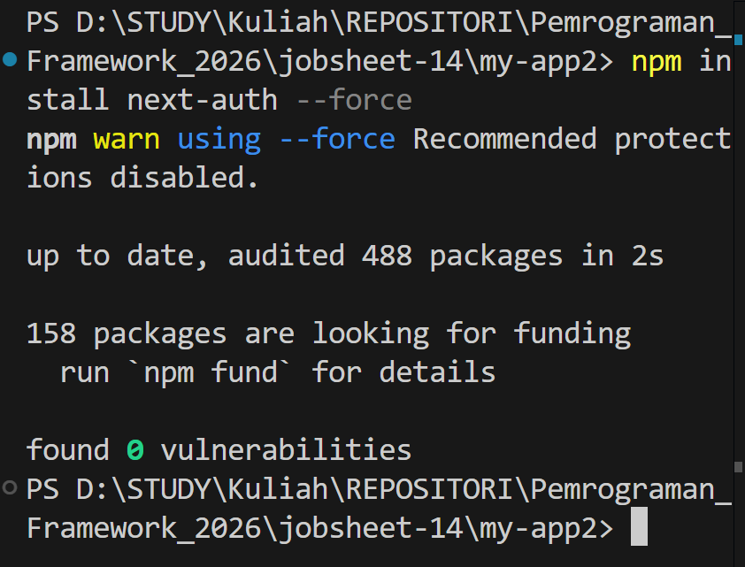
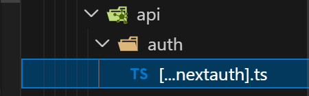
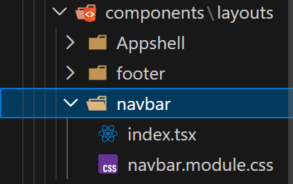
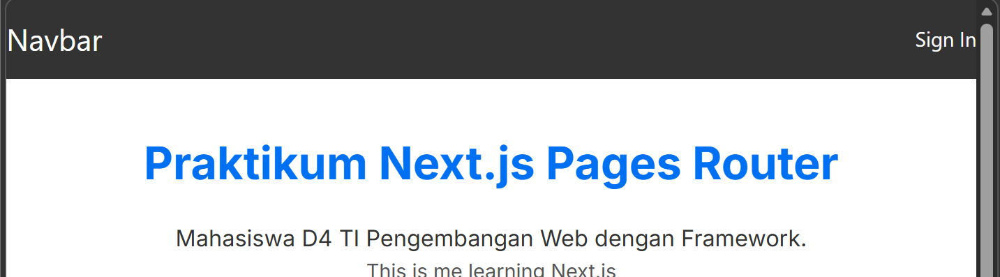
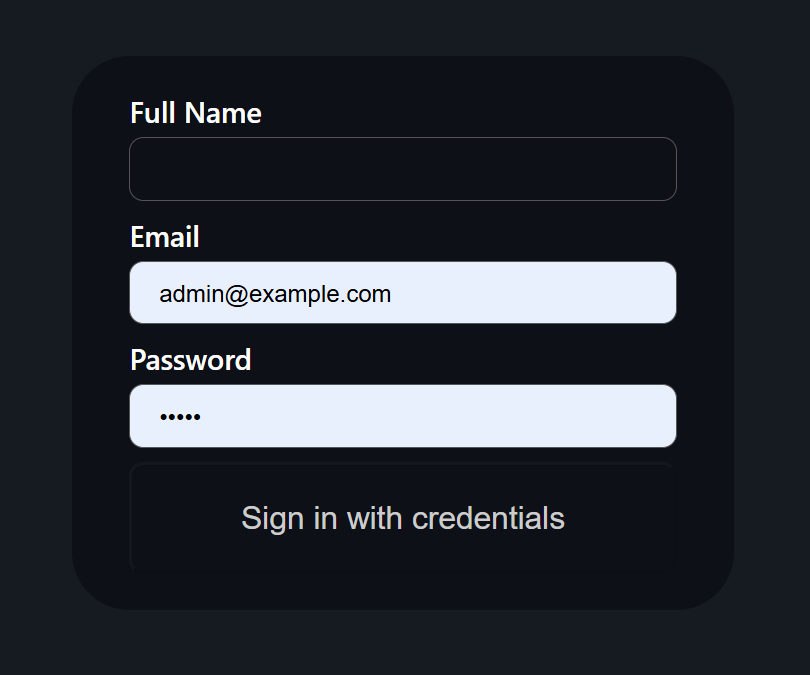
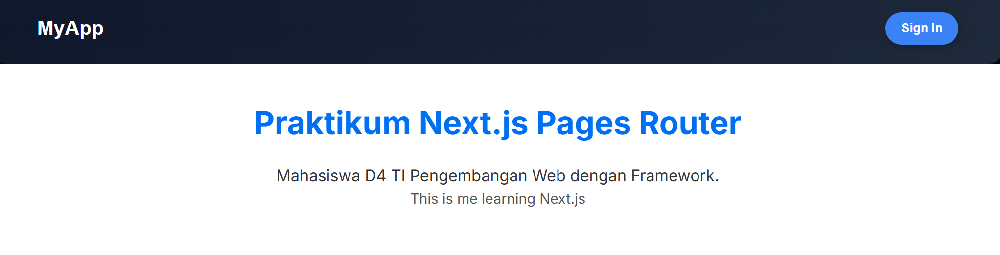
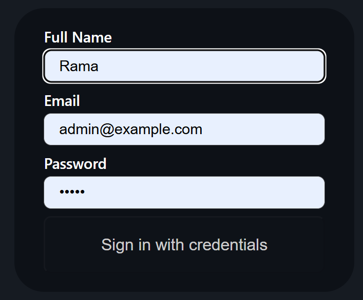
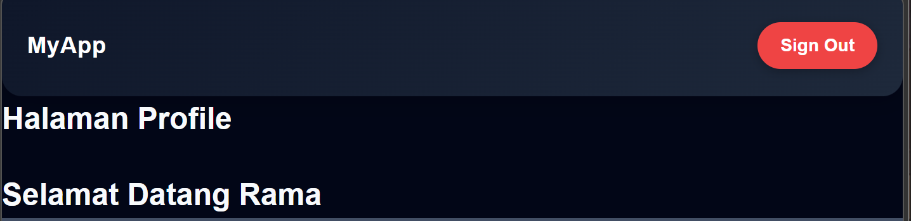

# PEMROGRAMAN BERBASIS FRAMEWORK

## JOBSHEET 14

### Sistem Autentikasi & Proteksi Route menggunakan NextAuth

---

## 👤 Identitas Mahasiswa

* **Nama:** Ghetsa Ramadhani Riska A.
* **Kelas:** TI-3D
* **No. Absen:** 10
* **Program Studi:** Teknik Informatika
* **Jurusan:** Teknologi Informasi
* **Politeknik Negeri Malang**
* **Tahun:** 2026

---

# A. Tujuan Praktikum

Setelah menyelesaikan praktikum ini, mahasiswa mampu:

1. Menjelaskan konsep autentikasi dan otorisasi.
2. Mengimplementasikan login menggunakan NextAuth.
3. Menggunakan Credentials Provider.
4. Mengelola session berbasis JWT.
5. Mengakses data session di frontend.
6. Melindungi halaman menggunakan middleware. 

---

# B. Dasar Teori Singkat

## 1️⃣ Autentikasi vs Otorisasi

| Konsep      | Fungsi                   |
| ----------- | ------------------------ |
| Autentikasi | Memverifikasi siapa user |
| Otorisasi   | Mengontrol akses user    |

Autentikasi digunakan untuk memastikan identitas pengguna, sedangkan otorisasi digunakan untuk menentukan apakah pengguna memiliki hak akses terhadap suatu halaman atau fitur tertentu. 

---

## 2️⃣ NextAuth

NextAuth merupakan library autentikasi untuk Next.js yang menyediakan berbagai metode autentikasi seperti OAuth (Google, GitHub), Credentials login (Email dan Password), serta mendukung session berbasis JWT dan integrasi dengan middleware.

Fitur utama NextAuth:

* OAuth login (Google, GitHub, dll)
* Credentials login (Email & Password)
* JWT session
* Middleware integration untuk proteksi halaman. 

---

# C. Langkah Kerja Praktikum

---

# Bagian 1 – Install NextAuth

Install library NextAuth pada project Next.js.

```bash
npm install next-auth --force
```

Setelah instalasi selesai, NextAuth siap digunakan untuk sistem autentikasi pada aplikasi.



---

# Bagian 2 – Konfigurasi API Auth

Buat folder dan file berikut:

```
pages/api/auth/[...nextauth].ts
```



File ini digunakan sebagai endpoint autentikasi NextAuth.

Modifikasi file `[...nextauth].ts`:

```tsx
import NextAuth from "next-auth";
import CredentialsProvider from "next-auth/providers/credentials";

export const authOptions = {
  session: {
    strategy: "jwt",
  },
  secret: process.env.NEXTAUTH_SECRET,
  providers: [
    CredentialsProvider({
      name: "Credentials",
      credentials: {
        fullname: { label: "Full Name", type: "text" },
        email: { label: "Email", type: "email" },
        password: { label: "Password", type: "password" },
      },
      async authorize(credentials) {
        const user = {
          email: credentials.email,
          password: credentials.password,
          fullname: credentials.fullname,
        };

        if (user) {
          return user;
        }

        return null;
      },
    }),
  ],
  callbacks: {
    async jwt({ token, user }) {
      if (user) {
        token.email = user.email;
      }
      return token;
    },
    async session({ session, token }) {
      session.user.email = token.email;
      return session;
    },
  },
};

export default NextAuth(authOptions);
```

Konfigurasi ini menggunakan Credentials Provider untuk autentikasi berbasis email dan password.

---

# Bagian 3 – Tambahkan Secret

Buka file:

```
.env.local
```

Tambahkan variabel berikut:

```
NEXTAUTH_SECRET=RANDOM_BASE64_STRING
```

Nilai `RANDOM_BASE64_STRING` dapat dibuat menggunakan generator Base64.

Secret ini digunakan untuk mengamankan session JWT pada NextAuth. 

---

# Bagian 4 – Tambahkan SessionProvider

Buka file berikut:

```
src/pages/_app.tsx
```

Modifikasi kode sebagai berikut:

```tsx
import "../styles/globals.css";
import type { AppProps } from "next/app";
import AppShell from "../components/layouts/AppShell";
import Navbar from "../components/layouts/navbar";
import { SessionProvider } from "next-auth/react";

export default function App({ Component, pageProps: { session, ...pageProps } }: AppProps) {
  return (
    <SessionProvider session={session}>
      <AppShell>
        <Component {...pageProps} />
      </AppShell>
    </SessionProvider>
  );
}
```

SessionProvider digunakan untuk mengakses session autentikasi pada seluruh halaman aplikasi.

---

# Bagian 5 – Tambahkan Tombol Login dan Logout

Buka file berikut:

```
src/components/layouts/navbar/index.tsx
```



Modifikasi kode:

```tsx
import styles from "./navbar.module.scss";
import { signIn, signOut, useSession } from "next-auth/react";

const Navbar = () => {
  const { data } = useSession();

  return (
    <div className={styles.navbar}>
      <div className="big">
        Navbar
      </div>

      {data ? (
        <button onClick={() => signOut()}>Sign Out</button>
      ) : (
        <button onClick={() => signIn()}>Sign In</button>
      )}
    </div>
  );
};

export default Navbar;
```

---

## Modifikasi navbar.module.scss

Tambahkan styling berikut:

```scss
.navbar {
  width: 100%;
  height: 64px;
  background-color: #333;
  color: white;
  display: flex;
  align-items: center;
  justify-content: space-between;
}
```

Jalankan aplikasi:

```
http://localhost:3000
```

Klik tombol **Sign In** untuk melakukan login.





---

# Bagian 6 – Menampilkan Session

Agar dapat mengakses data session di frontend, modifikasi navbar:

```tsx
import styles from "./navbar.module.scss";
import { signIn, signOut, useSession } from "next-auth/react";

const Navbar = () => {
  const { data } = useSession();

  return (
    <div className={styles.navbar}>
      <div className="big">
        Navbar
      </div>

      {data ? (
        <button onClick={() => signOut()}>Sign Out</button>
      ) : (
        <button onClick={() => signIn()}>Sign In</button>
      )}
    </div>
  );
};

export default Navbar;
```

Setelah login berhasil, session akan tersimpan dan dapat diakses menggunakan `useSession()`.

---

# D. Menambahkan Data Tambahan (Full Name)

Buka file:

```
pages/api/auth/[...nextauth].ts
```

Tambahkan field fullname pada bagian credentials:

```tsx
credentials: {
  fullname: { label: "Full Name", type: "text" },
  email: { label: "Email", type: "email" },
  password: { label: "Password", type: "password" },
},
```

Modifikasi callbacks:

```tsx
callbacks: {
  async jwt({ token, user }) {
    if (user) {
      token.email = user.email;
      token.fullname = user.fullname;
    }
    return token;
  },

  async session({ session, token }) {
    session.user.email = token.email;
    session.user.fullname = token.fullname;
    return session;
  },
}
```

Dengan modifikasi ini data fullname akan tersimpan di session.






---

# E. Proteksi Halaman Profile

## Membuat Halaman Profile

Buat file berikut:

```
pages/profile/index.tsx
```

Isi kode:

```tsx
import { useSession } from "next-auth/react";

const HalamanProfile = () => {
  const { data } = useSession();

  return (
    <div>
      <h1>Halaman Profile</h1>
      <h3>Selamat datang {data?.user?.fullname}</h3>
    </div>
  );
};

export default HalamanProfile;
```

Jalankan browser:

```
http://localhost:3000/profile
```



Jika login berhasil maka halaman profile dapat diakses.

---

# F. Middleware Authorization

## Membuat File Middleware

Buat folder:

```
src/middleware
```

Buat file:

```
withAuth.ts
```

Modifikasi kode:

```tsx
import { getToken } from "next-auth/jwt";
import { NextResponse } from "next/server";

export async function withAuth(req) {
  const token = await getToken({ req });

  if (!token) {
    return NextResponse.redirect(new URL("/", req.url));
  }

  return NextResponse.next();
}
```

---

## Modifikasi middleware.ts

```tsx
import { NextResponse } from "next/server";
import { withAuth } from "./middleware/withAuth";

export default withAuth;

export const config = {
  matcher: ["/profile"],
};
```

Jika user belum login maka tidak dapat mengakses halaman profile dan akan diarahkan ke halaman home. 

---

# G. Pengujian

## Uji 1 – Belum Login

Akses halaman:

```
/profile
```

Hasil:

User akan diarahkan ke halaman home.

---

## Uji 2 – Sudah Login

Login terlebih dahulu kemudian akses:

```
/profile
```

Hasil:

User dapat mengakses halaman profile.

---

## Uji 3 – Logout

Klik tombol **Sign Out** kemudian akses kembali:

```
/profile
```

Hasil:

User tidak dapat mengakses halaman profile.

---

# H. Alur Login NextAuth

Alur proses autentikasi menggunakan NextAuth:

```
User klik Sign In
↓
NextAuth menampilkan form credentials
↓
authorize() dijalankan
↓
JWT dibuat
↓
Session disimpan
↓
Frontend mengakses session menggunakan useSession()
```

---

# I. Tugas Praktikum

1. Implementasikan login menggunakan Credentials Provider.
2. Tambahkan field full name.
3. Tampilkan full name setelah login.
4. Buat halaman profile.
5. Lindungi halaman profile menggunakan middleware.
6. Dokumentasikan:

* Screenshot login
* Screenshot session
* Screenshot redirect middleware. 

---

# J. Pertanyaan Analisis

### 1. Mengapa session menggunakan JWT?

Karena JWT memungkinkan penyimpanan session secara stateless sehingga tidak memerlukan penyimpanan session di database.

---

### 2. Apa perbedaan authorize() dan callback jwt()?

`authorize()` digunakan untuk memverifikasi kredensial user saat login, sedangkan `jwt()` digunakan untuk memodifikasi atau menambahkan data pada token JWT.

---

### 3. Mengapa middleware perlu getToken()?

`getToken()` digunakan untuk membaca token JWT dari session sehingga middleware dapat mengetahui apakah user sudah login atau belum.

---

### 4. Apa risiko jika NEXTAUTH_SECRET tidak digunakan?

Tanpa NEXTAUTH_SECRET, token JWT dapat lebih mudah dimanipulasi sehingga keamanan session menjadi lebih lemah.

---

### 5. Apa perbedaan autentikasi dan otorisasi dalam sistem ini?

Autentikasi digunakan untuk memastikan identitas pengguna saat login, sedangkan otorisasi digunakan untuk menentukan apakah pengguna memiliki hak akses terhadap halaman tertentu seperti halaman profile.

---

# K. Kesimpulan

Pada praktikum ini telah dipelajari:

* Konsep autentikasi dan otorisasi pada aplikasi web
* Implementasi login menggunakan NextAuth
* Penggunaan Credentials Provider
* Pengelolaan session menggunakan JWT
* Menampilkan session di frontend
* Proteksi halaman menggunakan middleware

NextAuth memberikan solusi autentikasi yang mudah diintegrasikan pada aplikasi Next.js serta menyediakan fitur proteksi route menggunakan middleware sehingga keamanan aplikasi menjadi lebih baik.
