# PEMROGRAMAN BERBASIS FRAMEWORK

## JOBSHEET 15

### Implementasi Sistem Registrasi (Database Integration)

---

## 👤 Identitas Mahasiswa

* **Nama:** Ghetsa Ramadhani Riska A.
* **Kelas:** TI-3D
* **No. Absen:** 10
* **Program Studi:** Teknik Informatika
* **Jurusan:** Teknologi Informasi
* **Politeknik Negeri Malang**
* **Tahun:** 2026

---

# A. Tujuan Praktikum

Setelah menyelesaikan praktikum ini, mahasiswa mampu:

1. Membuat form registrasi.
2. Mengirim data menggunakan metode POST.
3. Membuat API Route untuk register.
4. Melakukan validasi email unik.
5. Meng-hash password menggunakan bcrypt.
6. Menyimpan user ke database.
7. Menampilkan loading dan error handling di frontend. 

---

# B. Dasar Teori Singkat

## 1️⃣ Alur Sistem Register

Alur kerja sistem registrasi adalah sebagai berikut:

```text
User mengisi form
↓
Frontend mengirim POST ke API
↓
API memeriksa method POST
↓
Cek apakah email sudah ada
↓
Jika belum ada, password di-hash
↓
Data user disimpan ke database
↓
API mengembalikan response
```

---

## 2️⃣ Mengapa Password Harus Di-Hash?

Password tidak boleh disimpan dalam bentuk plaintext karena:

* Berisiko jika terjadi kebocoran data
* Tingkat keamanan sangat rendah
* Tidak sesuai dengan best practice pengembangan aplikasi

Untuk proses hashing password digunakan library:

```text
bcrypt
```

Hashing memastikan password yang disimpan di database tidak dapat dibaca secara langsung. 

---

# C. Langkah Kerja Praktikum

---

## Bagian 1 – Membuat Register View

### 1️⃣ Membuat folder dan file register view

Buat folder pada `views/auth` dengan nama:

```text
register
```

Tambahkan 2 file:

```text
views/auth/register/index.tsx
views/auth/register/register.module.scss
```

---

### 2️⃣ Modifikasi file `views/auth/register/index.tsx`

Tambahkan struktur awal tampilan register:

```tsx
import Link from "next/link";
import style from "../../auth/register/register.module.scss";

const TampilRegister = () => {
  return (
    <div className={style.register}>
      <h1 className={style.register__title}>Halaman Register</h1>
      <Link href="/auth/login">Ke Halaman Login</Link>
    </div>
  );
};

export default TampilRegister;
```

---

### 3️⃣ Modifikasi file `pages/auth/register.tsx`

Buka file:

```text
pages/auth/register.tsx
```

Modifikasi menjadi:

```tsx
import Link from "next/link";
import TampilRegister from "../../views/auth/register";

const halamanRegister = () => {
  return (
    <>
      <TampilRegister />
    </>
  );
};

export default halamanRegister;
```

---

### 4️⃣ Modifikasi file `register.module.scss`

Tambahkan styling awal untuk halaman register.

---

### 5️⃣ Tambahkan form input pada `views/auth/register/index.tsx`

Form berisi:

* Email
* Full Name
* Password
* Button Register

Struktur input email:

```tsx
<div className={style.register__form__item}>
  <label
    htmlFor="email"
    className={style.register__form__item__label}
  >
    Email
  </label>
  <input
    type="email"
    id="email"
    name="email"
    placeholder="Email"
    className={style.register__form__item__input}
  />
</div>
```

Struktur input fullname:

```tsx
<div className={style.register__form__item}>
  <label
    htmlFor="fullname"
    className={style.register__form__item__label}
  >
    Fullname
  </label>
  <input
    type="text"
    id="fullname"
    name="fullname"
    placeholder="Fullname"
    className={style.register__form__item__input}
  />
</div>
```

Struktur input password:

```tsx
<div className={style.register__form__item}>
  <label
    htmlFor="password"
    className={style.register__form__item__label}
  >
    Password
  </label>
  <input
    type="password"
    id="password"
    name="password"
    placeholder="Password"
    className={style.register__form__item__input}
  />
</div>
```

Tombol register:

```tsx
<button type="submit" className={style.register__form__item__button}>
  Register
</button>
```

---

### 6️⃣ Kode keseluruhan `views/auth/register/index.tsx`

```tsx
import Link from "next/link";
import style from "../../auth/register/register.module.scss";

const TampilRegister = () => {
  return (
    <div className={style.register}>
      <h1 className={style.register__title}>Halaman Register</h1>
      <form className={style.register__form}>
        <div className={style.register__form__item}>
          <label htmlFor="email" className={style.register__form__item__label}>
            Email
          </label>
          <input
            type="email"
            id="email"
            name="email"
            placeholder="Email"
            className={style.register__form__item__input}
          />
        </div>

        <div className={style.register__form__item}>
          <label htmlFor="fullname" className={style.register__form__item__label}>
            Fullname
          </label>
          <input
            type="text"
            id="fullname"
            name="fullname"
            placeholder="Fullname"
            className={style.register__form__item__input}
          />
        </div>

        <div className={style.register__form__item}>
          <label htmlFor="password" className={style.register__form__item__label}>
            Password
          </label>
          <input
            type="password"
            id="password"
            name="password"
            placeholder="Password"
            className={style.register__form__item__input}
          />
        </div>

        <button type="submit" className={style.register__form__item__button}>
          Register
        </button>

        <p className={style.register__form__item__text}>
          Sudah punya akun?
          <Link href="/auth/login"> Ke Halaman Login</Link>
        </p>
      </form>
    </div>
  );
};

export default TampilRegister;
```

---

### 7️⃣ Modifikasi lengkap `register.module.scss`

Tambahkan styling form register, termasuk:

* container register
* title
* form
* item
* input
* button
* animasi
* responsive layout

Jalankan browser:

```text
http://localhost:3000/auth/register
```

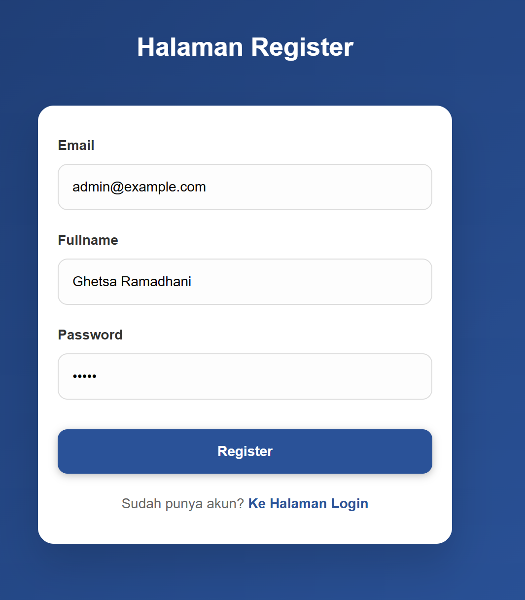

Tampilan halaman register akan muncul sesuai desain yang dibuat. 

---

## Bagian 2 – Membuat API Register

### 1️⃣ Modifikasi file `servicefirebase.ts`

Buka file:

```text
src/utils/db/servicefirebase.ts
```

Tambahkan fungsi `signUp` untuk mengecek email dan menyimpan data ke collection `users`.

Contoh struktur fungsi:

```ts
export async function signUp(
  userData: {
    email: string;
    fullname: string;
    password: string;
  },
  callback: Function
) {
  const q = query(
    collection(db, "users"),
    where("email", "==", userData.email)
  );

  const querySnapshot = await getDocs(q);
  const data = querySnapshot.docs.map((doc) => ({
    id: doc.id,
    ...doc.data(),
  }));

  if (data.length > 0) {
    callback({
      status: "error",
      message: "User already exists",
    });
  } else {
    await addDoc(collection(db, "users"), userData);
    callback({
      status: "success",
      message: "User registered successfully",
    });
  }
}
```

---

### 2️⃣ Buat file API register

Buat file:

```text
pages/api/register.ts
```

---

### 3️⃣ Modifikasi file `register.ts`

Tambahkan handler POST untuk memproses registrasi user.

```tsx
import type { NextApiRequest, NextApiResponse } from "next";
import { signUp } from "../../utils/db/servicefirebase";

type Data = {
  status: boolean;
  message: string;
};

export default async function handler(
  req: NextApiRequest,
  res: NextApiResponse<Data>
) {
  if (req.method === "POST") {
    await signUp(req.body, (result: { status: string; message: string }) => {
      if (result.status === "success") {
        res.status(200).json({ status: true, message: result.message });
      } else {
        res.status(400).json({ status: false, message: result.message });
      }
    });
  } else {
    res.status(405).json({ status: false, message: "Method not allowed" });
  }
}
```

---

### 4️⃣ Modifikasi `views/auth/register/index.tsx`

Tambahkan beberapa kode agar form dapat mengirim data ke API `/api/register`.

Tambahkan import:

```tsx
import Link from "next/link";
import style from "../../auth/register/register.module.scss";
import { useRouter } from "next/router";
import { useState } from "react";
```

Tambahkan state dan handler submit:

```tsx
const [isLoading, setIsLoading] = useState(false);
const router = useRouter();

const handleSubmit = async (event: React.FormEvent<HTMLFormElement>) => {
  event.preventDefault();
  setIsLoading(true);

  const form = event.currentTarget;
  const formData = new FormData(form);

  const data = {
    email: formData.get("email"),
    fullname: formData.get("fullname"),
    password: formData.get("password"),
  };

  const result = await fetch("/api/register", {
    method: "POST",
    headers: {
      "Content-Type": "application/json",
    },
    body: JSON.stringify(data),
  });

  const response = await result.json();

  if (result.status === 200) {
    form.reset();
    router.push("/auth/login");
  } else {
    console.log(response.message);
  }

  setIsLoading(false);
};
```

Gunakan pada form:

```tsx
<form className={style.register__form} onSubmit={handleSubmit}>
```

Jalankan browser:

```text
http://localhost:3000/auth/register
```

Isikan data dan klik register. Jika berhasil maka user akan diarahkan ke halaman login. 

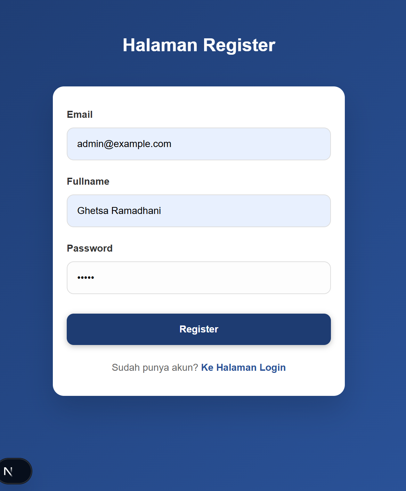

---

## Bagian 3 – Install bcrypt

### 1️⃣ Install bcrypt

```bash
npm install bcrypt --force
```

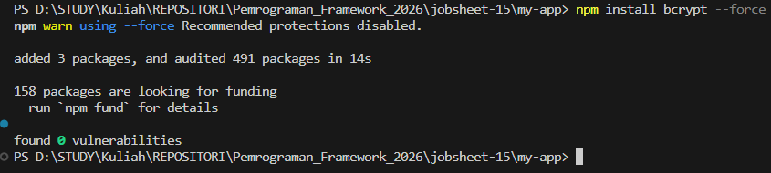

### 2️⃣ Install type definition bcrypt

```bash
npm install --save-dev @types/bcrypt --force
```

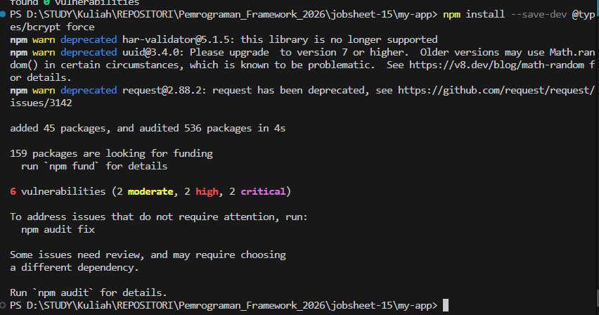

---

### 3️⃣ Modifikasi `servicefirebase.ts`

Import bcrypt:

```ts
import bcrypt from "bcrypt";
```

Lalu ubah fungsi `signUp` agar password di-hash sebelum disimpan.

Contoh modifikasi:

```ts
export async function signUp(
  userData: {
    email: string;
    fullname: string;
    password: string;
    role?: string;
  },
  callback: Function
) {
  const q = query(
    collection(db, "users"),
    where("email", "==", userData.email)
  );

  const querySnapshot = await getDocs(q);
  const data = querySnapshot.docs.map((doc) => ({
    id: doc.id,
    ...doc.data(), 
  }));

  if (data.length === 0) {
    userData.password = await bcrypt.hash(userData.password, 10);

    await addDoc(collection(db, "users"), userData);

    callback({
      status: "success",
      message: "User registered successfully",
    });
  } else {
    callback({
      status: "error",
      message: "User already exists",
    });
  }
}
```

Jalankan browser kembali:

```text
http://localhost:3000/auth/register
```

Lakukan registrasi, lalu buka Firebase. Jika berhasil maka data akan masuk ke collection `users` dan password sudah dalam bentuk hash. 

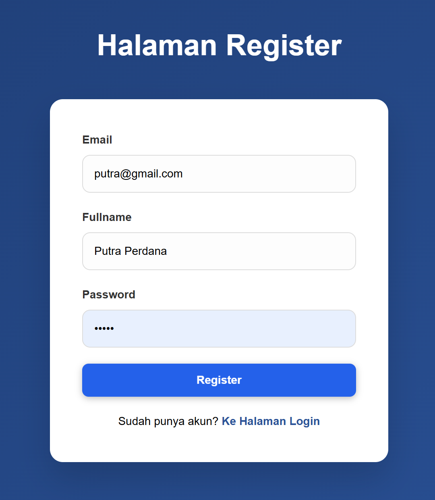

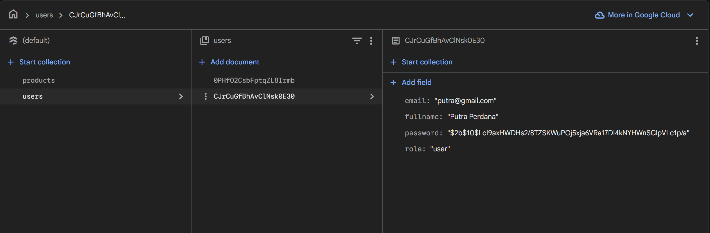


### Menampilkan Error dan Loading di UI

Jika user memasukkan email yang sama, sistem memang tidak memproses data, tetapi belum ada pemberitahuan di halaman. Untuk itu diperlukan modifikasi tambahan pada file register view.

---

### 1️⃣ Modifikasi `views/auth/register/index.tsx`

Tambahkan state error:

```tsx
const [error, setError] = useState("");
```

Ubah bagian error handling menjadi:

```tsx
if (result.status === 200) {
  form.reset();
  setError("");
  router.push("/auth/login");
} else {
  setError(response.status === 400 ? "Email already exist" : "An error occurred");
}
```

Tambahkan tampilan pesan error pada UI, misalnya di atas title:

```tsx
{error && <p className={style.register__error}>{error}</p>}
```

Pada bagian tombol ubah isi tombol menjadi loading state:

```tsx
<button type="submit" className={style.register__form__item__button}>
  {isLoading ? "Loading..." : "Register"}
</button>
```

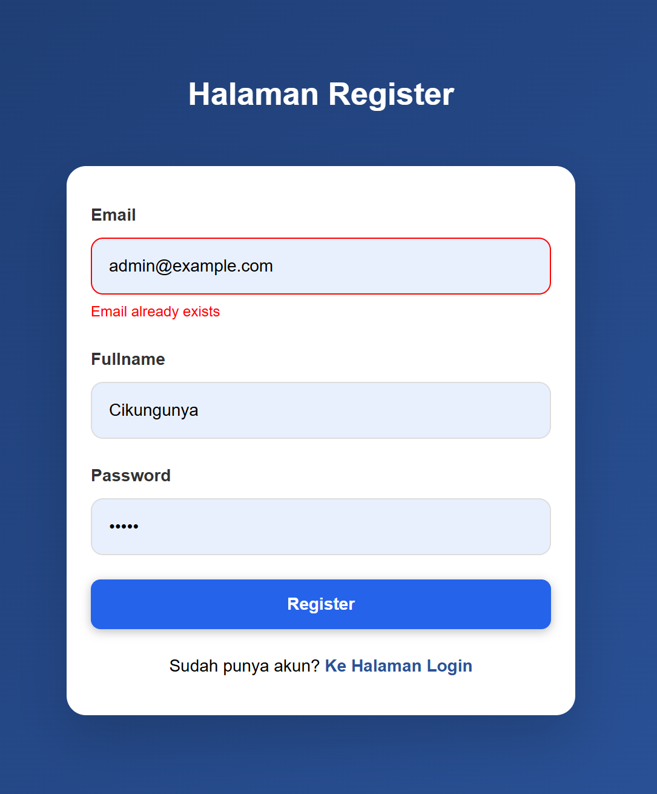

Pada jobsheet juga disebutkan bahwa line 34 diubah menjadi `email`, sehingga penanganan error disesuaikan agar pesan error email tampil dengan benar. 

---

### 2️⃣ Modifikasi `register.module.scss`

Tambahkan styling error:

```scss
.register__error {
  color: red;
  font-size: 14px;
  margin-bottom: 8px;
}
```

Jika berhasil maka halaman register akan menampilkan pesan error saat email sudah digunakan, dan tombol akan berubah menjadi loading saat proses register berlangsung. 

---

# D. Pengujian

## Uji 1 – Register Baru

Input:

* Email baru

Hasil:

* Data tersimpan di Firestore


* Password telah di-hash


* User diarahkan ke login
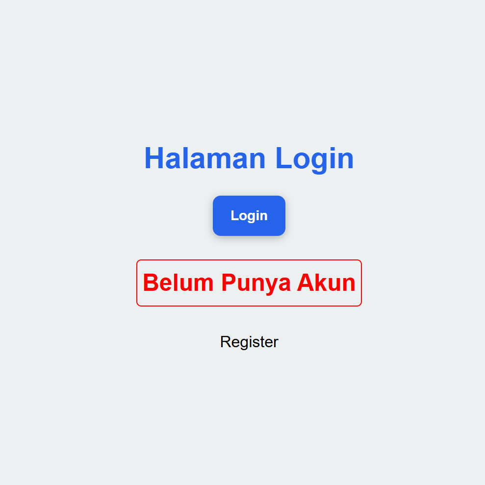

---

## Uji 2 – Email Sudah Ada

Input:

* Email yang sama

Hasil:


* API mengembalikan error 400
* Muncul pesan `Email already exists`

---

## Uji 3 – Method GET

Akses:

```text
/api/register
```

Hasil:

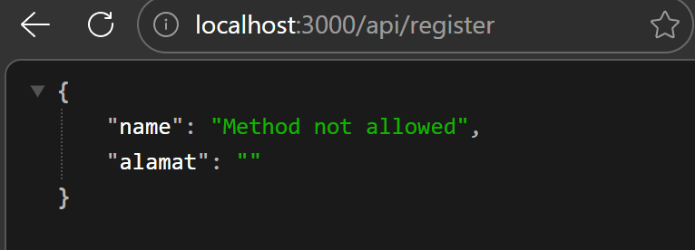

* API mengembalikan status `405 Method Not Allowed` 

---

# E. Struktur Database (Firestore)

Collection:

```text
users
```

Field yang digunakan:

| Field     | Tipe            |
| --------- | --------------- |
| fullName  | string          |
| email     | string          |
| password  | string (hashed) |
| role      | string          |
| createdAt | timestamp       |

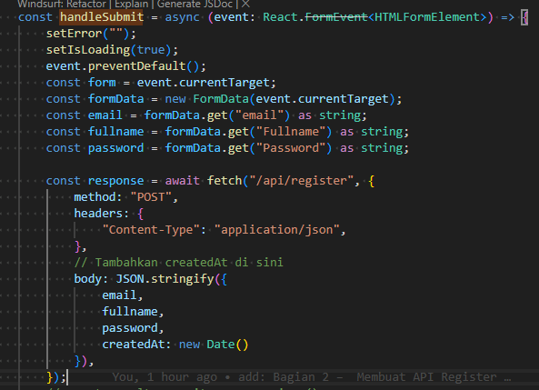

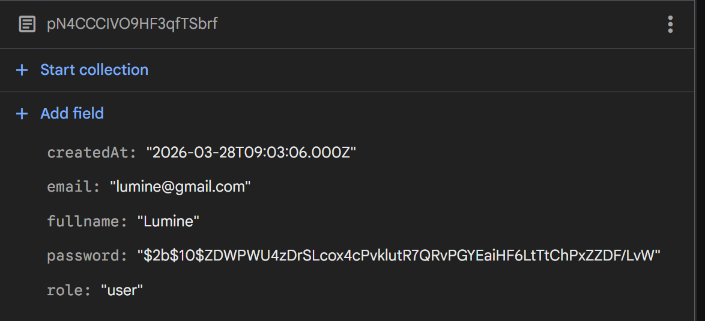

---

# F. Tugas Praktikum

1. Implementasikan register terhubung database.
2. Tambahkan validasi:

   * Email wajib
   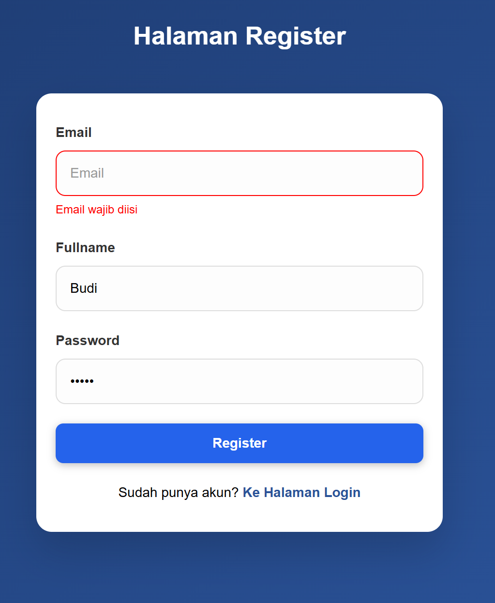

   * Password minimal 6 karakter
   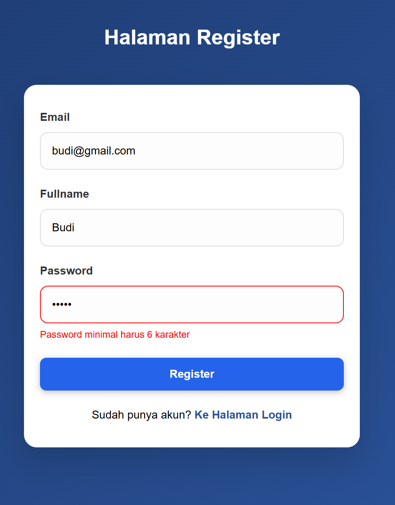

3. Tambahkan role default `"member"`.
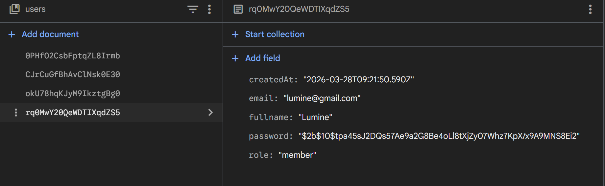

4. Tampilkan pesan error di UI.
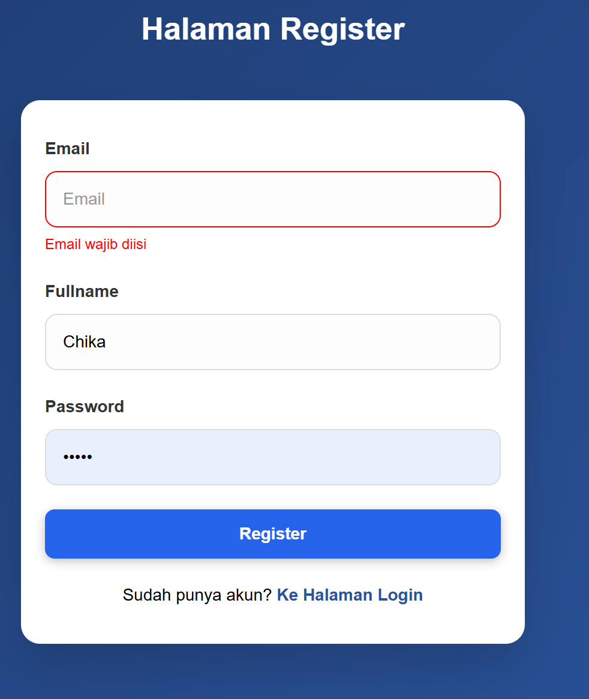

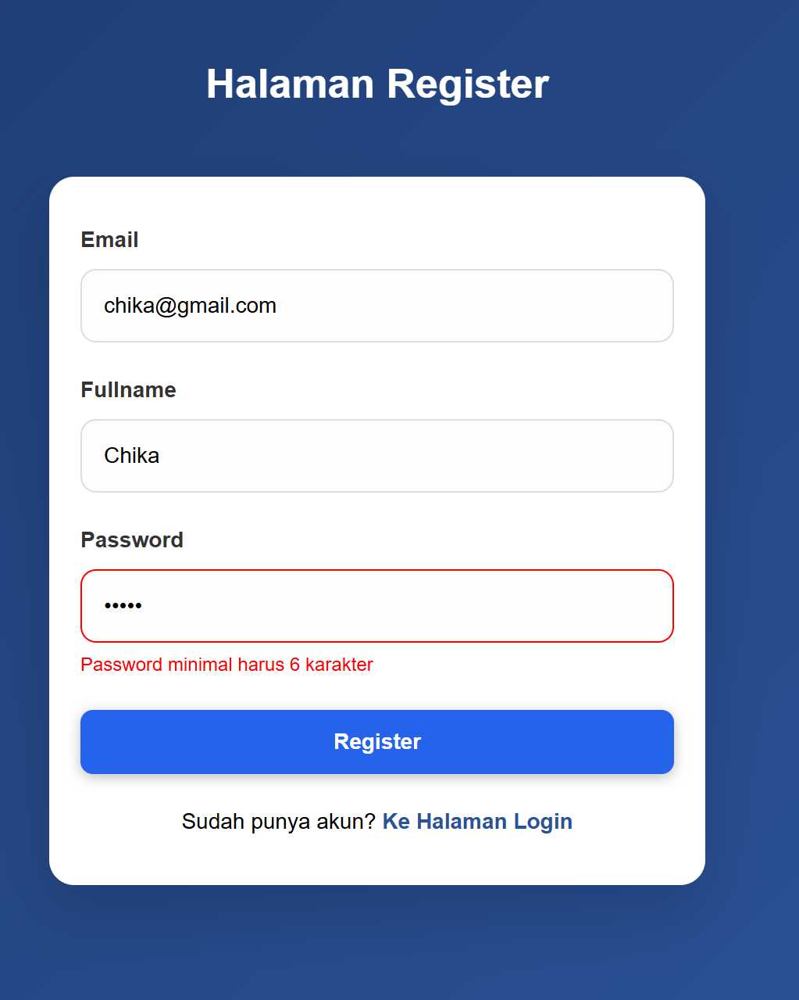

5. Screenshot hasil:

   * Register sukses
   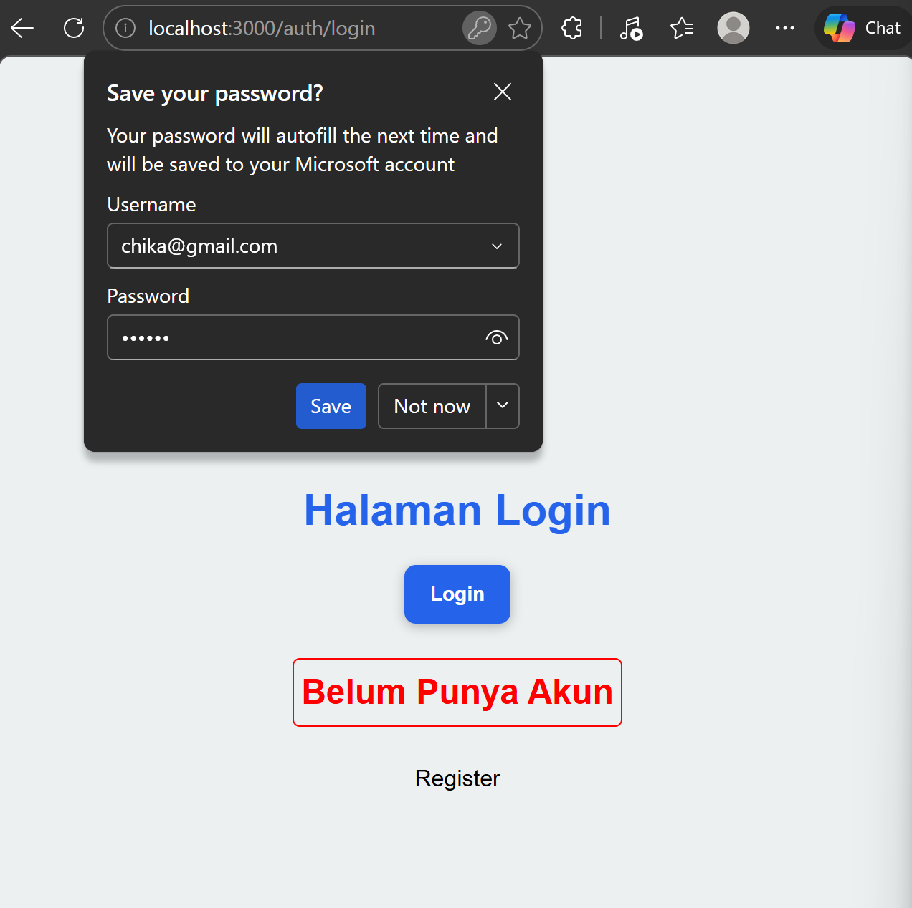

   * Email sudah ada
   

   * Database Firestore. 
   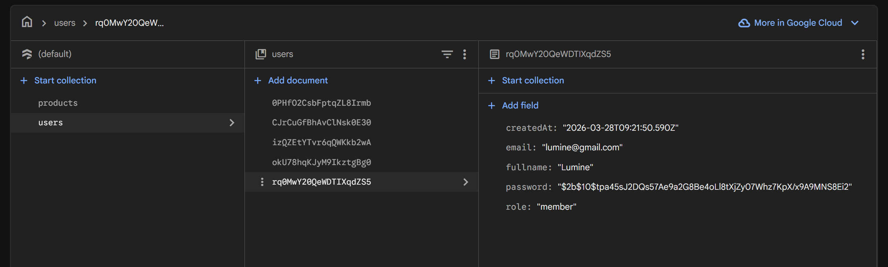

---

# G. Pertanyaan Analisis

### 1. Mengapa password harus di-hash?

Karena password dalam bentuk plaintext sangat berbahaya jika database bocor. Dengan hashing, password tidak dapat langsung dibaca sehingga keamanan data user lebih terjaga.

### 2. Apa perbedaan `addDoc` dan `setDoc`?

`addDoc` digunakan untuk menambahkan dokumen baru dengan ID otomatis, sedangkan `setDoc` digunakan untuk membuat atau menimpa dokumen dengan ID tertentu.

### 3. Mengapa perlu validasi method POST?

Karena endpoint register hanya seharusnya menerima data registrasi dari form. Jika method lain diperbolehkan, endpoint dapat disalahgunakan.

### 4. Apa risiko jika email tidak dicek unik?

Akan terjadi duplikasi akun dengan email yang sama, sehingga dapat menimbulkan konflik saat login dan mengurangi integritas data user.

### 5. Apa fungsi role pada user?

Role digunakan untuk menentukan hak akses atau otorisasi user dalam sistem, misalnya sebagai `member`, `admin`, atau role lainnya.

---

# H. Output yang Diharapkan

Mahasiswa menghasilkan:

* Form registrasi berfungsi
* API POST berjalan
* Email unik tervalidasi
* Password ter-hash
* Data tersimpan di Firestore
* Error tampil di UI
* Redirect ke login

---

# I. Kesimpulan

Pada praktikum ini telah dipelajari:

* Pembuatan form registrasi pada Next.js
* Pengiriman data menggunakan method POST
* Implementasi API Route untuk register
* Validasi email unik
* Hash password menggunakan bcrypt
* Penyimpanan data user ke Firestore
* Penanganan loading dan error di frontend

Implementasi registrasi yang terhubung ke database memberikan gambaran alur autentikasi dasar yang aman dan terstruktur. Dengan validasi email, hashing password, dan error handling yang baik, sistem registrasi menjadi lebih siap digunakan dalam aplikasi web modern.
