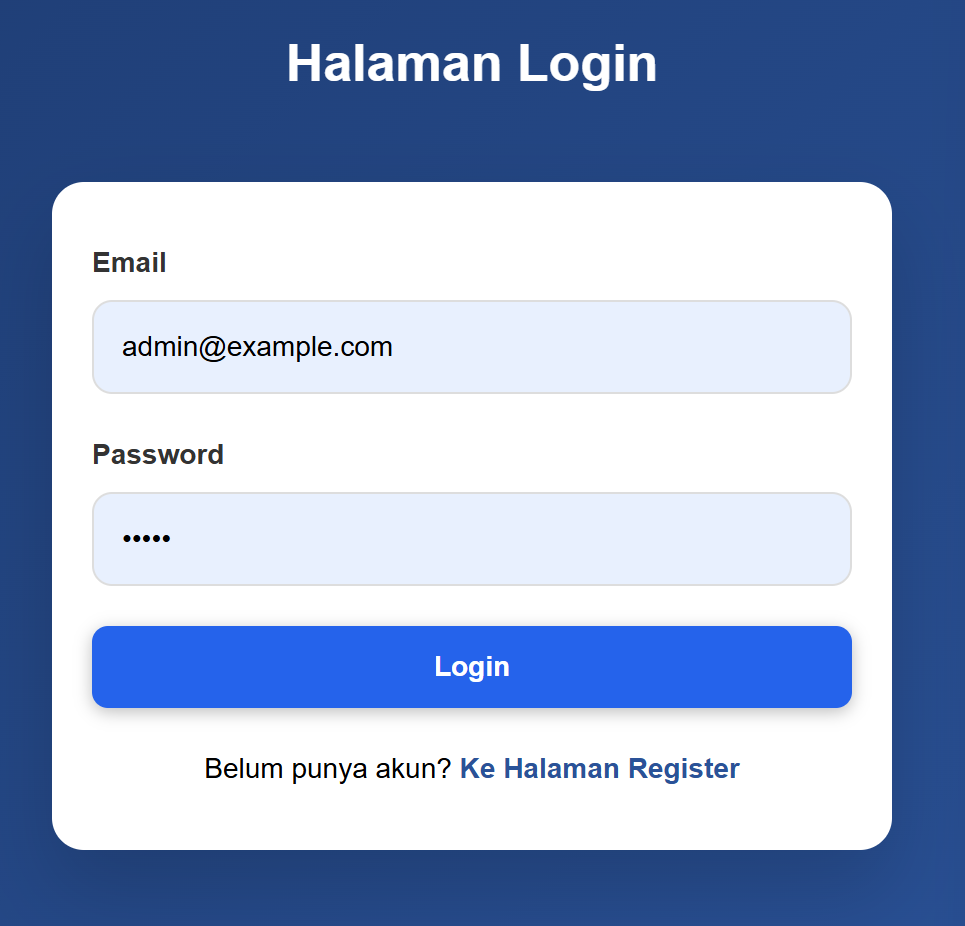

# PEMROGRAMAN BERBASIS FRAMEWORK

## JOBSHEET 16

### Implementasi Login Database & Multi-Role

---

## 👤 Identitas Mahasiswa

* **Nama:** Ghetsa Ramadhani Riska A.
* **Kelas:** TI-3D
* **No. Absen:** 10
* **Program Studi:** Teknik Informatika
* **Jurusan:** Teknologi Informasi
* **Politeknik Negeri Malang**
* **Tahun:** 2026

---

# A. Tujuan Praktikum

Setelah menyelesaikan praktikum ini, mahasiswa mampu:

1. Menghubungkan sistem login dengan database Firestore.
2. Melakukan verifikasi password menggunakan library `bcrypt.compare`.
3. Membuat dan mengintegrasikan *custom login page*.
4. Mengimplementasikan logic *callback URL* untuk redirect setelah login.
5. Menerapkan *middleware authentication*.
6. Menerapkan *Role-Based Access Control* (RBAC) untuk membatasi akses halaman berdasarkan role.

---

# B. Dasar Teori Singkat

## 1️⃣ Alur Login Database

Sistem autentikasi menggunakan NextAuth yang terintegrasi dengan database memiliki alur sebagai berikut:

1. User memasukkan email dan password pada form login.
2. NextAuth memanggil fungsi `authorize()`.
3. Sistem melakukan query ke Firestore untuk mencari user berdasarkan email.
4. Jika user ditemukan, password yang diinput dibandingkan dengan password ter-hash di database menggunakan `bcrypt.compare()`.
5. Jika valid, data user (id, email, fullname, role) dikembalikan untuk pembuatan Token dan Session.
6. User diarahkan (redirect) sesuai dengan `callbackURL`.

---

## 2️⃣ Role-Based Access Control (RBAC)

RBAC adalah metode pembatasan akses sistem kepada user yang berwenang berdasarkan peran mereka. Dalam praktikum ini, terdapat dua role utama:
* **User:** Role standar untuk akses fitur umum.
* **Admin:** Role khusus untuk akses halaman manajemen (misalnya `/admin`).

---

# C. Langkah Kerja Praktikum

---

## Bagian 1 – Custom Login Page

### 1️⃣ Menambahkan Custom Page di NextAuth

Buka file `src/pages/api/auth/[...nextauth].ts` dan tambahkan konfigurasi `pages` agar NextAuth menggunakan route login buatan kita sendiri.

```ts
export const authOptions: NextAuthOptions = {
  session: {
    strategy: "jwt",
  },
  secret: process.env.NEXTAUTH_SECRET,
  providers: [
    // ... credentials provider
  ],
  pages: {
    signIn: "/auth/login",
  },
};
```

---

## Bagian 2 – Handle Login di Frontend

### 1️⃣ Membuat View Login

Buat folder `src/views/auth/login` dan tambahkan file `index.tsx` serta `login.module.scss`. Gunakan template dari register sebelumnya namun hapus input **Fullname**.

### 2️⃣ Modifikasi Logic Handle Submit

Gunakan fungsi `signIn` dari `next-auth/react` untuk mengirim data ke provider.

```tsx
const { push, query } = useRouter();
const callbackUrl: any = query.callbackUrl || "/";

const handleSubmit = async (event: any) => {
  event.preventDefault();
  setIsLoading(true);
  try {
    const res = await signIn("credentials", {
      redirect: false,
      email: event.target.email.value,
      password: event.target.password.value,
      callbackUrl,
    });

    if (!res?.error) {
      push(callbackUrl);
    } else {
      setError("Email or password invalid");
    }
  } catch (err) {
    setError("An error occurred");
  } finally {
    setIsLoading(false);
  }
};
```



---

## Bagian 3 – Authorize & Database Integration

### 1️⃣ Modifikasi Service Firebase

Buka `src/utils/db/servicefirebase.ts` dan tambahkan fungsi untuk mengambil data user berdasarkan email dari Firestore.

```ts
export async function login(email: string) {
  const q = query(collection(db, "users"), where("email", "==", email));
  const querySnapshot = await getDocs(q);
  const data = querySnapshot.docs.map((doc) => ({
    id: doc.id,
    ...doc.data(),
  }));
  if (data.length > 0) return data[0];
  return null;
}
```

### 2️⃣ Implementasi Authorize dengan Bcrypt

Modifikasi provider credentials pada `[...nextauth].ts` untuk memverifikasi password.

```ts
async authorize(credentials) {
  const user: any = await login(credentials?.email);
  if (user) {
    const isPasswordValid = await bcrypt.compare(credentials.password, user.password);
    if (isPasswordValid) {
      return user;
    }
  }
  return null;
}
```

---

## Bagian 4 – Menambahkan Role ke Token & Session

Agar middleware bisa mengecek role, kita perlu memasukkan data role ke dalam JWT dan Session callback.

```ts
callbacks: {
  async jwt({ token, user }: any) {
    if (user) {
      token.role = user.role;
      token.fullname = user.fullname;
    }
    return token;
  },
  async session({ session, token }: any) {
    if (session.user) {
      session.user.role = token.role;
      session.user.fullname = token.fullname;
    }
    return session;
  }
}
```

---

## Bagian 5 – Proteksi Route dengan Middleware

Modifikasi middleware untuk mengecek akses berdasarkan role, khususnya untuk route `/admin`.

```ts
// Contoh logic di middleware
if (url.startsWith("/admin") && token.role !== "admin") {
  return NextResponse.redirect(new URL("/", req.url));
}
```

---

# D. Pengujian

## Uji 1 – Login Berhasil
Input email dan password yang benar. User diarahkan ke dashboard atau halaman yang diminta sebelumnya.

## Uji 2 – Login Gagal
Input password yang salah. Muncul pesan error "Email or password invalid" pada UI.

## Uji 3 – Proteksi Role (User ke Admin)
Login sebagai user biasa, lalu coba akses `/admin`. Sistem secara otomatis melakukan redirect ke home page.

---

# E. Struktur Database Users

Collection: `users`

| Field | Tipe | Keterangan |
| :--- | :--- | :--- |
| email | string | Alamat email user |
| password | string | Password ter-hash (bcrypt) |
| fullName | string | Nama lengkap user |
| role | string | admin / user |

---

# F. Tugas Praktikum

1. Implementasikan login yang terhubung dengan database Firestore.
2. Tambahkan field `role` pada dokumen user di Firestore (buat manual atau via register).
3. Buat halaman baru:
   * `/profile`: Bisa diakses semua user yang sudah login.
   * `/admin`: Hanya bisa diakses oleh user dengan `role: admin`.
4. Implementasikan `callbackUrl` agar user kembali ke halaman awal setelah dipaksa login.
5. Screenshot hasil pengujian login dan proteksi halaman admin.

---

# G. Pertanyaan Analisis

### 1. Mengapa password harus diverifikasi dengan `bcrypt.compare`?
Karena password di database disimpan dalam format hash satu arah. `bcrypt.compare` melakukan proses hashing pada input user dan membandingkannya dengan hash di database tanpa perlu mengetahui password aslinya.

### 2. Mengapa role disimpan di token?
Menyimpan role di JWT (Token) memungkinkan aplikasi melakukan pengecekan hak akses di sisi client (middleware/frontend) tanpa harus melakukan request database tambahan setiap kali pindah halaman.

### 3. Apa fungsi `callbackUrl`?
Fungsinya adalah meningkatkan UX dengan mengarahkan user kembali ke halaman yang awalnya ingin mereka akses sebelum mereka diminta untuk melakukan login.

### 4. Mengapa middleware penting untuk security?
Middleware memberikan lapisan keamanan di level server-side yang mampu memblokir request sebelum halaman dirender, sehingga data sensitif tidak sempat terkirim ke client yang tidak berhak.

---

# H. Output yang Diharapkan

Mahasiswa menghasilkan:
* Sistem login yang dinamis menggunakan data Firestore.
* Keamanan password menggunakan hashing bcrypt.
* Halaman login kustom yang rapi.
* Sistem otorisasi berbasis role (RBAC) yang fungsional.

---

# I. Kesimpulan

Pada praktikum ini, telah berhasil diimplementasikan sistem autentikasi dan otorisasi yang kompleks. Dengan mengintegrasikan NextAuth, Firestore, dan Bcrypt, aplikasi memiliki standar keamanan produksi yang baik. Penggunaan middleware dan callback URL memastikan aplikasi tetap aman namun tetap memberikan pengalaman pengguna yang mulus.