# PEMROGRAMAN BERBASIS FRAMEWORK

## JOBSHEET 17

### Implementasi Login Google Provider dengan NextAuth.js + Firebase

---

## 👤 Identitas Mahasiswa

* **Nama:** Ghetsa Ramadhani Riska A.
* **Kelas:** TI-3D
* **No. Absen:** 10
* **Program Studi:** Teknik Informatika
* **Jurusan:** Teknologi Informasi
* **Politeknik Negeri Malang**
* **Tahun:** 2026

---

# A. Tujuan Praktikum

Setelah menyelesaikan praktikum ini, mahasiswa mampu:

1. Mengkonfigurasi Google OAuth melalui Google Cloud Console.
2. Mengintegrasikan Google Provider ke NextAuth.js.
3. Mengelola session dan JWT callback.
4. Menyimpan data user Google ke Firebase Firestore.
5. Mengimplementasikan multi-role (member & admin).
6. Menampilkan avatar dan data profil user.
7. Memahami alur autentikasi OAuth berbasis provider.

---

# B. Dasar Teori Singkat

## 1️⃣ Alur Login Google (OAuth)

```text
User klik login Google
↓
Redirect ke Google OAuth
↓
User memilih akun Google
↓
Google mengirim data user ke NextAuth
↓
JWT Callback dijalankan
↓
Data user disimpan / diupdate ke database
↓
Session dibuat
↓
User login berhasil
```

---

## 2️⃣ Perbedaan Login Credential vs Google

| Login Credential              | Login Google          |
| ----------------------------- | --------------------- |
| Input manual email & password | Login via akun Google |
| Perlu bcrypt compare          | Tidak perlu password  |
| Data dari form                | Data dari Google API  |
| Lebih kompleks di backend     | Lebih cepat & praktis |

---

# C. Langkah Kerja Praktikum

---

## Bagian 1 – Konfigurasi Google OAuth

### 1️⃣ Masuk ke Google Cloud Console

Buka:

```text
https://console.cloud.google.com/apis/credentials
```

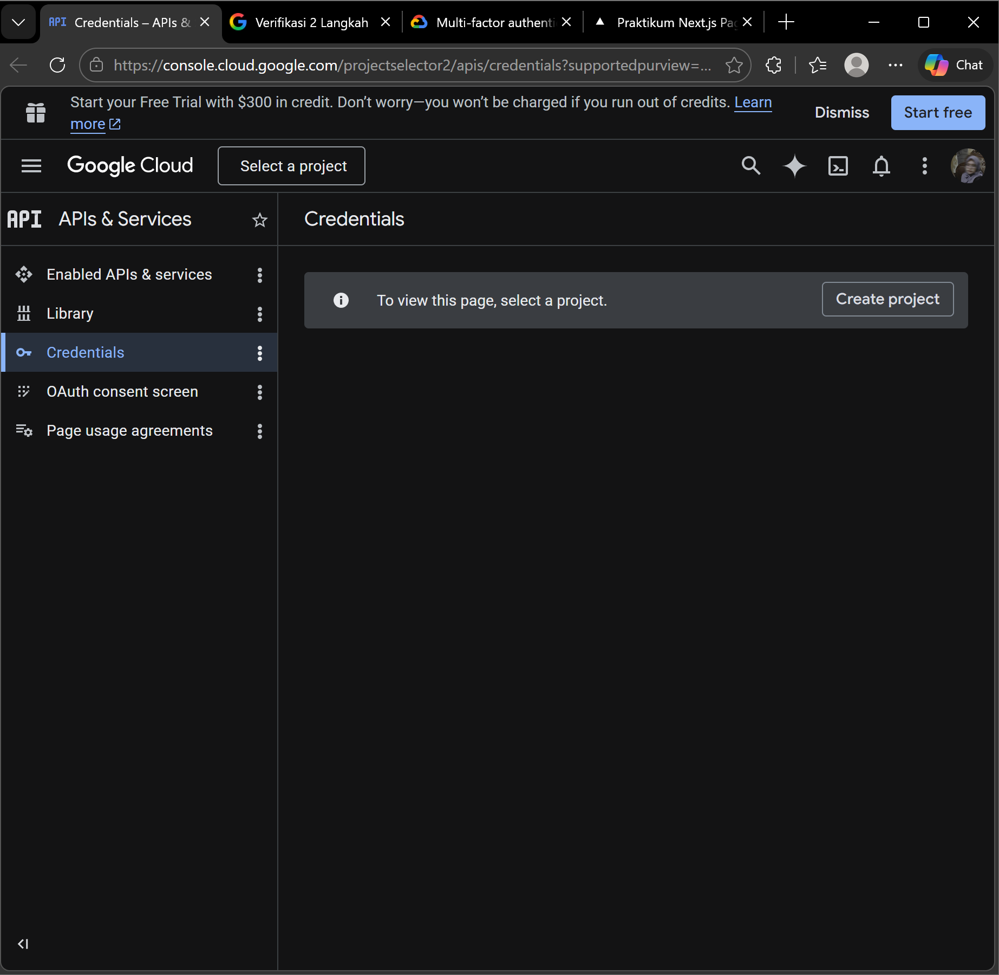

---

### 2️⃣ Buat Project Baru

* Klik **New Project**
* Nama project:

```text
MyAppNext
```

* Klik **Create**

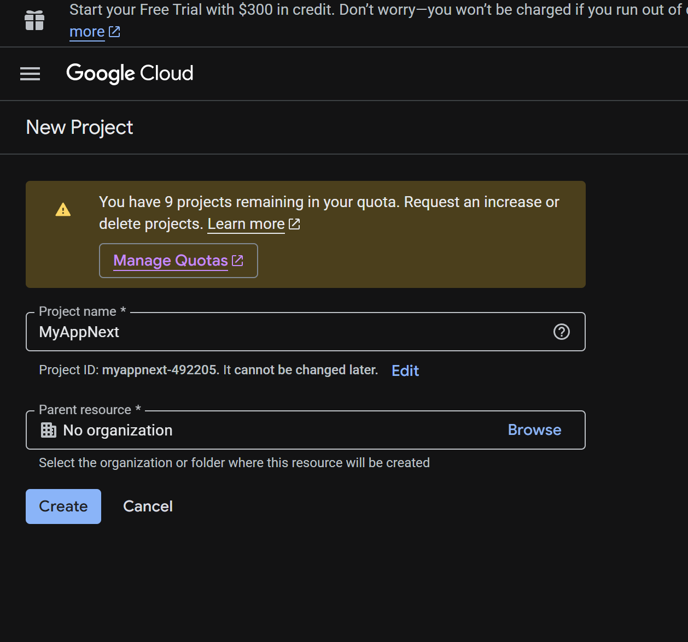

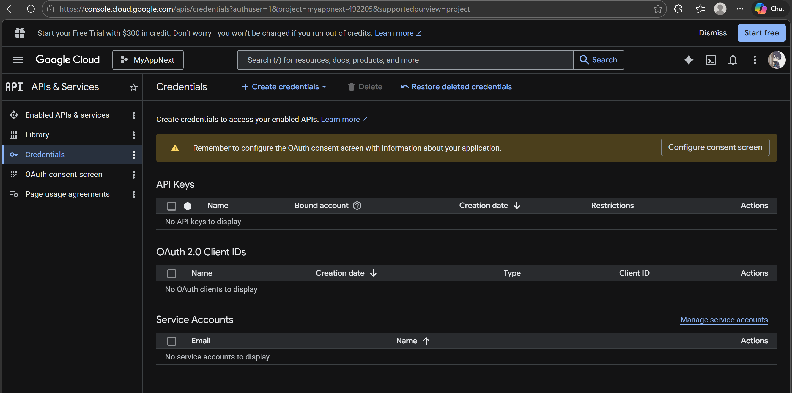

---

### 3️⃣ Konfigurasi OAuth Consent Screen

Langkah:

1. Pilih menu **OAuth Consent Screen**
2. Klik **Get Started**
3. Isi data aplikasi
4. Klik **Create**

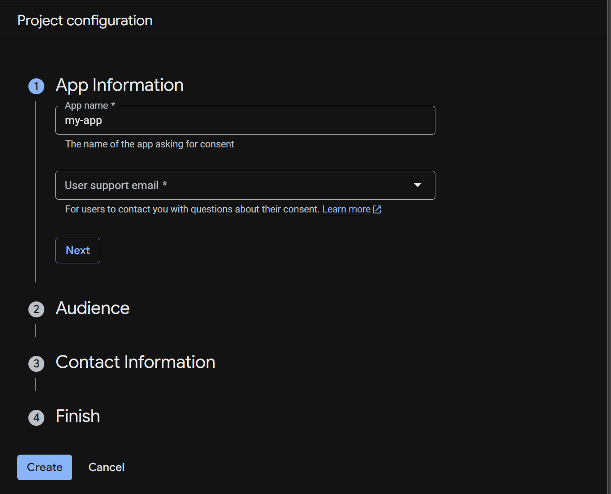

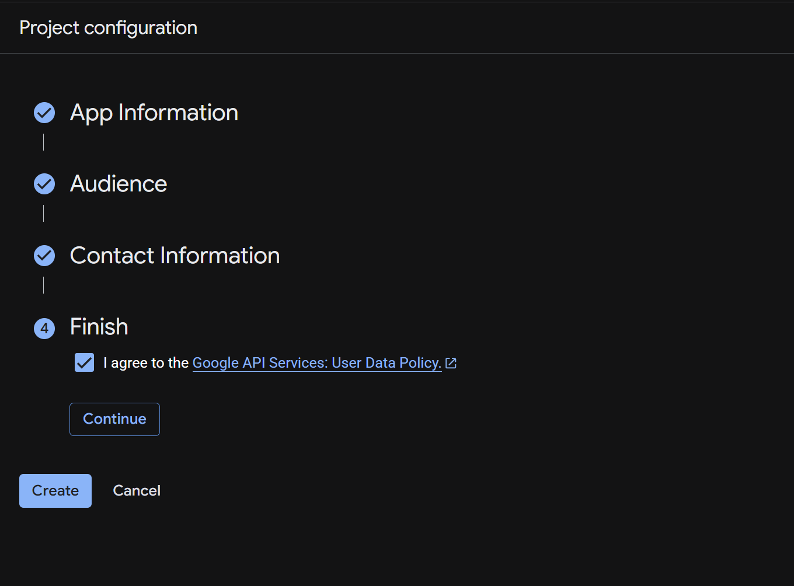

---

### 4️⃣ Buat OAuth Client ID

Langkah:

1. Masuk ke menu **Credentials**
2. Klik **Create Client**
3. Pilih Web Application
4. Copy:

```text
Client ID
Client Secret
```

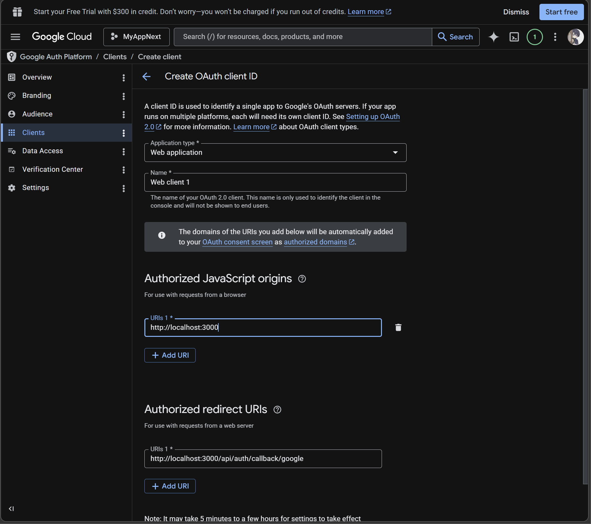

---

## Bagian 2 – Menambahkan Environment Variables

### 1️⃣ Modifikasi file `.env`

Tambahkan:

```env
GOOGLE_CLIENT_ID=your_client_id
GOOGLE_CLIENT_SECRET=your_client_secret
```

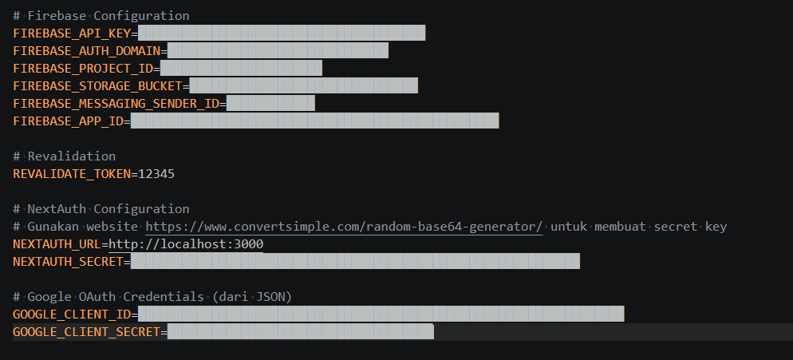

---

## Bagian 3 – Konfigurasi Google Provider di NextAuth

### 1️⃣ Modifikasi file `[...nextauth].ts`

Tambahkan Google Provider:

```ts
import GoogleProvider from "next-auth/providers/google";

providers: [
  GoogleProvider({
    clientId: process.env.GOOGLE_CLIENT_ID!,
    clientSecret: process.env.GOOGLE_CLIENT_SECRET!,
  }),
],
```

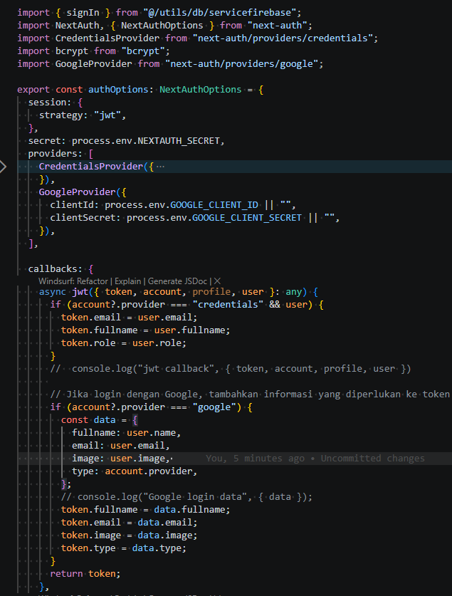

---

### 2️⃣ Tambahkan JWT dan Session Callback

```ts
callbacks: {
  async jwt({ token, account, profile }) {
    if (account && profile) {
      token.email = profile.email;
      token.name = profile.name;
      token.image = profile.picture;
    }
    return token;
  },

  async session({ session, token }) {
    session.user.email = token.email;
    session.user.name = token.name;
    session.user.image = token.image;
    return session;
  },
}
```

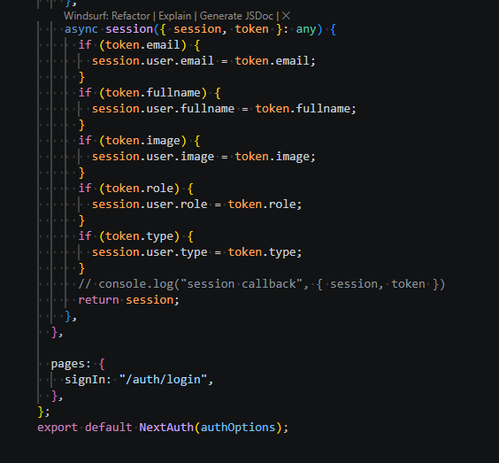

---

## Bagian 4 – Menambahkan Button Login Google

### 1️⃣ Modifikasi `views/auth/login/index.tsx`

Tambahkan tombol login Google:

```tsx
import { signIn } from "next-auth/react";

<button onClick={() => signIn("google")}>
  Sign in with Google
</button>
```

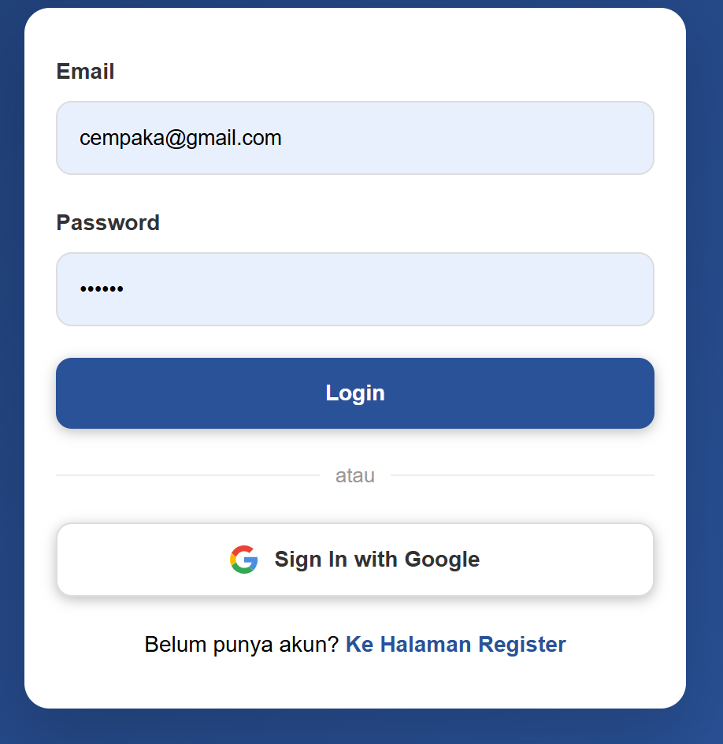

---

### 2️⃣ Jalankan aplikasi

```text
http://localhost:3000/auth/login
```

Klik tombol Google → login berhasil.

---

## Bagian 5 – Menampilkan Avatar User

### 1️⃣ Modifikasi `views/auth/login/index.tsx`

Tambahkan:

```tsx
import { useSession } from "next-auth/react";

const { data: session } = useSession();

{session && (
  <div>
    
    <p>{session.user?.name}</p>
  </div>
)}
```


---

### 2️⃣ Modifikasi CSS

Tambahkan styling avatar pada:

```text
navbar.module.css
```

Contoh:

```css
.avatar {
  width: 40px;
  border-radius: 50%;
}
```


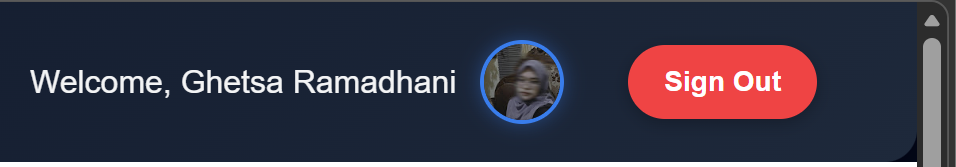

---

## Bagian 6 – Menyimpan Data Google ke Firebase

### 1️⃣ Modifikasi `servicefirebase.ts`

Tambahkan fungsi simpan user Google:

```ts
export async function signInWithGoogle(userData: any) {
  const q = query(
    collection(db, "users"),
    where("email", "==", userData.email)
  );

  const snapshot = await getDocs(q);

  if (snapshot.empty) {
    await addDoc(collection(db, "users"), {
      ...userData,
      role: "member",
    });
  } else {
    const docRef = snapshot.docs[0].ref;
    await updateDoc(docRef, userData);
  }
}
```

---

### 2️⃣ Panggil di JWT Callback

Modifikasi `[...nextauth].ts`:

```ts
import { signInWithGoogle } from "@/utils/db/servicefirebase";

callbacks: {
  async jwt({ token, account, profile }) {
    if (account?.provider === "google") {
      const userData = {
        email: profile?.email,
        fullname: profile?.name,
        image: profile?.picture,
      };

      await signInWithGoogle(userData);
    }
    return token;
  },
}
```

---

### 3️⃣ Jalankan dan cek Firebase

Login menggunakan Google → data akan masuk ke Firestore.

---

## Bagian 7 – Implementasi Multi-Role

### 1️⃣ Tambahkan role pada database

Default:

```text
member
```

Ubah manual di Firebase untuk admin:

```text
admin
```

---

### 2️⃣ Proteksi halaman admin

Modifikasi middleware (`withAuth.ts`):

```ts
if (pathname.startsWith("/admin")) {
  if (token?.role !== "admin") {
    return NextResponse.redirect(new URL("/", req.url));
  }
}
```

---

# D. Pengujian

## Uji 1 – Login Google Pertama Kali

Hasil:

* Data tersimpan di Firestore
* User berhasil login

---

## Uji 2 – Login Google Kedua Kali

Hasil:

* Data diupdate
* Tidak duplicate data

---

## Uji 3 – Role Member Akses Admin

Hasil:

* Redirect ke home

---

## Uji 4 – Role Admin Akses Admin

Hasil:

* Bisa masuk halaman admin

---

## Uji 5 – Avatar User

Hasil:

* Foto profil tampil di UI

---

# E. Struktur Database (Firestore)

Collection:

```text
users
```

Field yang digunakan:

| Field    | Tipe   |
| -------- | ------ |
| email    | string |
| fullname | string |
| image    | string |
| role     | string |

---

# F. Tugas Praktikum

1. Tambahkan role `editor`.
2. Buat halaman `/editor`.
3. Tambahkan provider GitHub.
4. Refactor service agar reusable.
5. Gunakan `next/image` untuk avatar.

---

# G. Pertanyaan Analisis

### 1. Apa perbedaan login credential dan login Google?

Login credential menggunakan email dan password manual, sedangkan login Google menggunakan autentikasi dari pihak ketiga tanpa perlu password.

### 2. Mengapa data Google tetap perlu disimpan ke database?

Agar aplikasi dapat mengelola data user seperti role dan riwayat aktivitas.

### 3. Apa fungsi JWT callback?

Untuk memproses dan menyimpan data user ke dalam token saat login.

### 4. Mengapa perlu multi-role?

Untuk membedakan hak akses antar user dalam sistem.

### 5. Apa risiko jika tidak menyimpan user ke database?

Tidak dapat mengelola role dan data user sehingga fitur aplikasi terbatas.

---

# H. Output yang Diharapkan

Mahasiswa menghasilkan:

* Login Google berhasil
* Integrasi NextAuth berjalan
* Data user tersimpan di Firestore
* JWT & session berjalan
* Multi-role berfungsi
* Avatar user tampil

---

# I. Kesimpulan

Pada praktikum ini telah dipelajari:

* Implementasi login menggunakan Google OAuth
* Integrasi Google Provider ke NextAuth.js
* Pengelolaan JWT dan session
* Penyimpanan data user ke Firebase Firestore
* Implementasi multi-role (admin & member)
* Menampilkan avatar dan data profil user

Dengan adanya login menggunakan Google, proses autentikasi menjadi lebih cepat dan user-friendly. Integrasi dengan database serta penerapan role membuat sistem autentikasi menjadi lebih fleksibel dan siap digunakan pada aplikasi modern.
