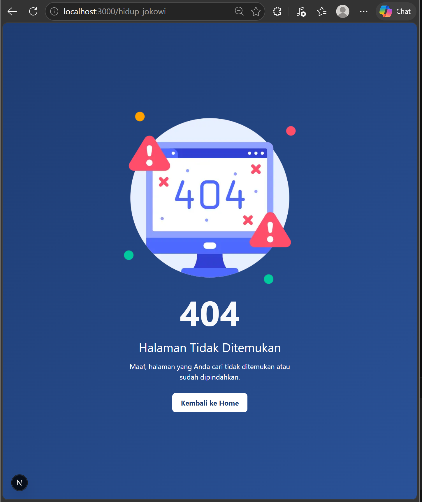

# PEMROGRAMAN BERBASIS FRAMEWORK

## JOBSHEET 18

### Optimasi Performa Aplikasi Menggunakan Fitur Next.js

---

## 👤 Identitas Mahasiswa

* **Nama:** Ghetsa Ramadhani Riska A.
* **Kelas:** TI-3D
* **No. Absen:** 10
* **Program Studi:** Teknik Informatika
* **Jurusan:** Teknologi Informasi
* **Politeknik Negeri Malang**
* **Tahun:** 2026

---

# A. Tujuan Praktikum

Setelah menyelesaikan praktikum ini, mahasiswa mampu:

1. Mengoptimasi gambar menggunakan next/image
2. Mengkonfigurasi remote image pada next.config.js
3. Mengoptimasi penggunaan font dengan next/font
4. Mengoptimasi script eksternal menggunakan next/script
5. Mengimplementasikan Dynamic Import untuk lazy loading komponen
6. Memahami dampak optimasi terhadap performa aplikasi

---

# B. Dasar Teori Singkat

## 1️⃣ Apa itu Optimasi Performa?

Optimasi performa adalah proses meningkatkan kecepatan dan efisiensi aplikasi agar:

* Loading lebih cepat
* Mengurangi penggunaan bandwidth
* Meningkatkan user experience
* Mendukung SEO

---

## 2️⃣ Fitur Optimasi pada Next.js

Next.js menyediakan beberapa fitur bawaan:

| Fitur          | Fungsi                     |
| -------------- | -------------------------- |
| next/image     | Optimasi gambar otomatis   |
| next/font      | Optimasi font tanpa CDN    |
| next/script    | Load script tanpa blocking |
| dynamic import | Lazy loading komponen      |

---

# C. Langkah Kerja Praktikum

---

## PRAKTIKUM 1 – Image Optimization

---

## Bagian 1 – Optimasi Gambar Lokal

### 1️⃣ Buka file halaman 404

Buka file:

```text
src/pages/404.tsx
```

---

### 2️⃣ Modifikasi penggunaan tag gambar

Sebelumnya menggunakan:

```tsx

```

Ubah menggunakan `next/image`:

```tsx
import Image from "next/image";

<Image 
  src="/no-results.png" 
  alt="404"
  width={500}
  height={500}
/>
```

---

### 3️⃣ Hasil optimasi



* Warning pada console hilang
* Gambar otomatis dioptimasi
* Mendukung lazy loading
* Mengurangi penggunaan bandwidth

---

## Bagian 2 – Optimasi Gambar Remote

---

### 1️⃣ Buka file product

Buka file:

```text
views/product/index.tsx
```

---

### 2️⃣ Modifikasi penggunaan image

Sebelumnya:

```tsx

```

Ubah menjadi:

```tsx
import Image from "next/image";

<Image
  src={product.image}
  alt={product.name}
  width={300} 
  height={300} 
  className={styles.product__image}
/>
```

---

### 3️⃣ Modifikasi file `next.config.js`

Tambahkan konfigurasi remote image:

```js
/** @type {import('next').NextConfig} */
const nextConfig = {
  reactStrictMode: true,
  images: {
    remotePatterns: [
      {
        protocol: "https",
        hostname: "static.nike.com", // Nike (Product)
        pathname: "/**",
      },
    ],
  },
};

module.exports = nextConfig;
```

---

### 4️⃣ Hasil optimasi


* Gambar di-proxy melalui `/\_next/image`
* Kompresi otomatis
* Performa loading meningkat

---

## PRAKTIKUM 2 – Font Optimization

---

## Bagian 1 – Menggunakan next/font

### 1️⃣ Buka file Appshell

```text
components/AppShell/index.tsx
```

---

### 2️⃣ Tambahkan import font

```tsx
import { Roboto } from "next/font/google";

const roboto = Roboto({
  subsets: ["latin"],
  weight: ["400", "700"],
});
```

---

### 3️⃣ Gunakan font pada aplikasi

```tsx
<div className={roboto.className}>
  {children}
</div>
```

---

### 4️⃣ Jalankan aplikasi

```text
http://localhost:3000/produk
```

---

### 5️⃣ Hasil optimasi


* Tidak perlu CDN
* Tidak blocking render
* Tidak terjadi FOUT
* Performa meningkat

---

## PRAKTIKUM 3 – Script Optimization

---

## Bagian 1 – Menggunakan next/script

### 1️⃣ Buka file Navbar

```text
components/layouts/Navbar/index.tsx
```

---

### 2️⃣ Tambahkan Script

```tsx
import Script from "next/script";

<div className={styles.navbar}>
  <div className={styles.navbar__brand} id="title"></div>
  <Script id="my-script" strategy="lazyOnload">
    {`document.getElementById('title').innerHTML = 'MyApp';`}
  </Script>
```

---

### 3️⃣ Perbedaan dengan JSX biasa

#### JSX biasa

```tsx
<div id="title">MyApp</div>
```

#### Menggunakan Script

```tsx
<div id="title"></div>
```

---

### 4️⃣ Penjelasan perbedaan

#### Metode Rendering

* JSX → langsung render
* Script → render setelah load

#### Performa & SEO

* JSX → SEO bagus
* Script → delay muncul

#### Keamanan

* JSX → aman (auto escape)
* Script → raw HTML (berisiko XSS)

---

### 5️⃣ Strategi Script

| Strategy          | Fungsi                 |
| ----------------- | ---------------------- |
| beforeInteractive | sebelum halaman siap   |
| afterInteractive  | setelah halaman siap   |
| lazyOnload        | setelah semua selesai  |
| worker            | menggunakan web worker |

---

### 6️⃣ Hasil optimasi

* Script tidak blocking
* Cocok untuk analytics
* Loading lebih ringan

---

## PRAKTIKUM 4 – Optimasi Avatar

---

### 1️⃣ Buka file Navbar

```text
components/layouts/Navbar/index.tsx
```

---

### 2️⃣ Modifikasi avatar

Gunakan next/image:

```tsx

```

---

### 3️⃣ Tambahkan konfigurasi hostname

Pada `next.config.js`:

```js
images: {
  domains: ["lh3.googleusercontent.com"],
}
```

---

### 4️⃣ Hasil optimasi

* Avatar lebih ringan
* Loading lebih cepat
* Mendukung lazy loading

---

## PRAKTIKUM 5 – Dynamic Import

---

### 1️⃣ Implementasi dynamic import

Contoh:

```tsx
import dynamic from "next/dynamic";

const HeavyComponent = dynamic(() => import("../components/HeavyComponent"), {
  loading: () => <p>Loading...</p>,
});
```

---

### 2️⃣ Penggunaan

```tsx
<HeavyComponent />
```

---

### 3️⃣ Hasil

* Komponen tidak langsung di-load
* Mengurangi bundle size
* Performa meningkat

---

# D. Pengujian

## Uji 1 – Image Optimization

Hasil:


* Tidak ada warning
* Gambar lebih cepat load

---

## Uji 2 – Font Optimization

Hasil:


* Font berubah ke Roboto
* Tidak ada flicker

---

## Uji 3 – Script Optimization

Hasil:


* Script tidak blocking
* Teks muncul setelah load

---

## Uji 4 – Dynamic Import

Hasil:


* Komponen load saat dibutuhkan
* Halaman lebih ringan

---

## Uji 5 – Avatar Optimization

Hasil:


* Avatar tampil dengan baik
* Loading lebih cepat

---

# E. Tugas Praktikum

1. Mengoptimasi semua gambar menggunakan next/image
2. Menggunakan minimal 1 font dari next/font
3. Menambahkan script Google Analytics
4. Menggunakan dynamic import
5. Melakukan pengujian performa menggunakan Lighthouse

## Hasil

1. **Optimasi Image (next/image)**

   * Ganti semua `` menjadi `<Image />`
   * Ambil screenshot sebelum
  

   * Ambil screenshot sesudah
  

2. **Menggunakan Font (next/font)**

   * Import font dari `next/font/google`
   * Terapkan ke layout/AppShell
  

   * Screenshot hasil tampilan font
  

3. **Google Analytics**

   * Tambahkan script `next/script` di `_app.tsx`
   

   * Jalankan project
   * Screenshot halaman Realtime di GA
   

4. **Dynamic Import**

   * Gunakan `dynamic()` pada minimal 1 komponen
   * Screenshot kode & hasil di browser
   

   

5. **Lighthouse Performance**

   * Buka DevTools → Lighthouse
   * Jalankan audit (Performance)
   * Screenshot hasil skor Lighthouse
   


---

# F. Refleksi & Diskusi

### 1. Mengapa `` tidak optimal?

Karena tidak memiliki fitur lazy loading, resizing, dan kompresi otomatis.

---

### 2. Perbedaan font CDN dan next/font?

Font CDN membutuhkan request eksternal, sedangkan next/font langsung di-bundle sehingga lebih cepat.

---

### 3. Mengapa script bisa memperlambat website?

Karena script dapat mem-block rendering jika tidak diatur dengan baik.

---

### 4. Kapan menggunakan dynamic import?

Saat komponen berat atau tidak selalu digunakan.

---

### 5. Dampak bundle size terhadap UX?

Semakin besar bundle size, semakin lama loading aplikasi.

---

# G. Output yang Diharapkan

Mahasiswa menghasilkan:

* Semua gambar teroptimasi
* Font terintegrasi dengan baik
* Script tidak blocking
* Dynamic import berjalan
* Performa aplikasi meningkat

---

# H. Kesimpulan

Pada praktikum ini telah dipelajari:

* Optimasi gambar menggunakan next/image
* Konfigurasi remote image
* Optimasi font dengan next/font
* Optimasi script menggunakan next/script
* Implementasi dynamic import

Dengan menggunakan fitur bawaan Next.js, performa aplikasi dapat meningkat secara signifikan tanpa perlu konfigurasi kompleks. Optimasi ini sangat penting untuk meningkatkan kecepatan, efisiensi, dan pengalaman pengguna dalam aplikasi web modern.
