# PEMROGRAMAN BERBASIS FRAMEWORK

## JOBSHEET 19

### Implementasi Unit Testing pada Next.js menggunakan Jest

---

## 👤 Identitas Mahasiswa

* **Nama:** Ghetsa Ramadhani Riska A.
* **Kelas:** TI-3D
* **No. Absen:** 10
* **Program Studi:** Teknik Informatika
* **Jurusan:** Teknologi Informasi
* **Politeknik Negeri Malang**
* **Tahun:** 2026

---

# A. Tujuan Praktikum

Setelah menyelesaikan praktikum ini, mahasiswa mampu:

1. Memahami konsep dasar Unit Testing
2. Menginstal dan mengkonfigurasi Jest di Next.js
3. Menggunakan React Testing Library
4. Membuat file testing (.spec / .test)
5. Menguji komponen dan halaman (pages)
6. Menghasilkan laporan coverage
7. Melakukan mocking pada Next Router
8. Menganalisis error melalui testing

---

# B. Dasar Teori Singkat

## 1️⃣ Pengertian Unit Testing

Unit Testing adalah proses pengujian Praktikum kecil dari aplikasi (unit), seperti:

* Component
* Pages
* Function
* Library

Tujuan utama:

* Mencegah bug
* Menjamin stabilitas kode
* Meningkatkan kualitas aplikasi
* Memenuhi standar industri (≥ 80% coverage)

---

## 2️⃣ Coverage Testing

Coverage digunakan untuk mengukur seberapa banyak kode yang sudah diuji, meliputi:

* Statements
* Branch
* Function
* Lines

Standar industri:

* ≥ 80% → Layak production
* < 80% → Perlu perbaikan

---

# C. Langkah Kerja Praktikum

---

## Praktikum 1 – Setup Jest di Next.js

### 1️⃣ Install Dependencies

Jalankan perintah berikut:

```bash
npm install jest jest-environment-jsdom @testing-library/react @testing-library/jest-dom --save-dev --force
```

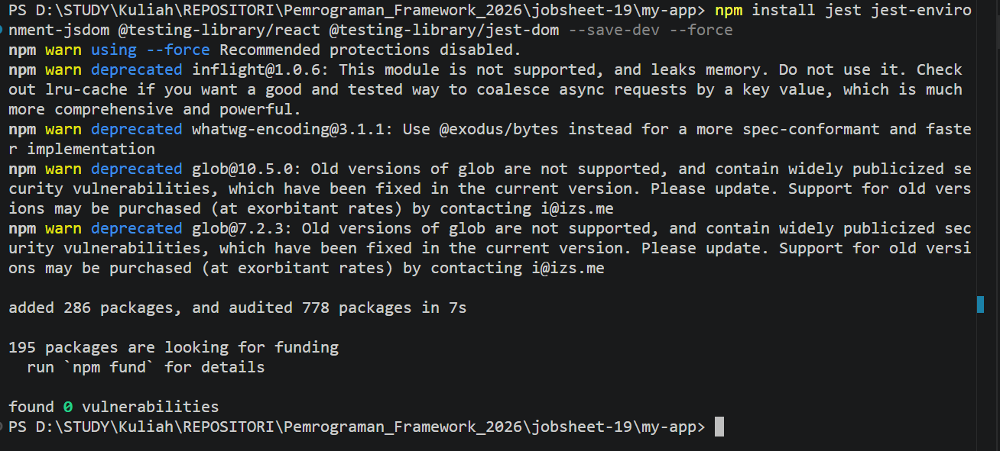

---

### 2️⃣ Membuat File Konfigurasi Jest

Buat file:

```text
jest.config.mjs
```

Isi konfigurasi dasar:

```js
import nextJest from 'next/jest.js';

const createJestConfig = nextJest({
  dir: './',
});

const config = {
  testEnvironment: 'jest-environment-jsdom',
};

export default createJestConfig(config);
```

---

### 3️⃣ Menambahkan Script pada package.json

```json
"scripts": {
  "test": "jest --passWithNoTests -u",
  "test:coverage": "npm run test -- --coverage",
  "test:watch": "jest --watch"
}
```

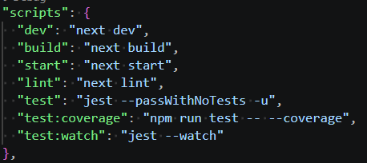

---

## Praktikum 2 – Struktur Folder Testing

### 1️⃣ Membuat Folder Testing

Buat folder:

```text
src/__test__/
```

Struktur folder:

```text
src
├── pages
├── components
├── views
└── __test__
    ├── pages
    └── components
```

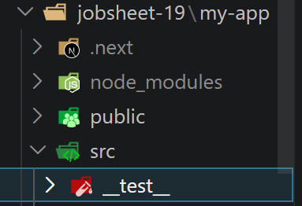

---

## Praktikum 3 – Testing Halaman About

### 1️⃣ Membuat File Testing

```text
src/__test__/pages/about.spec.tsx
```

---

### 2️⃣ Menambahkan Testing Snapshot

```tsx
import { render } from "@testing-library/react"
import AboutPage from "@/pages/about"

describe("About Page", () => {
  it("renders about page correctly", () => {
    const page = render(<AboutPage />)
    expect(page).toMatchSnapshot()
  })
})
```
---

#### Jika terjadi error

1. Instal Type Definitions 
```tsx
npm install --save-dev @types/jest
```

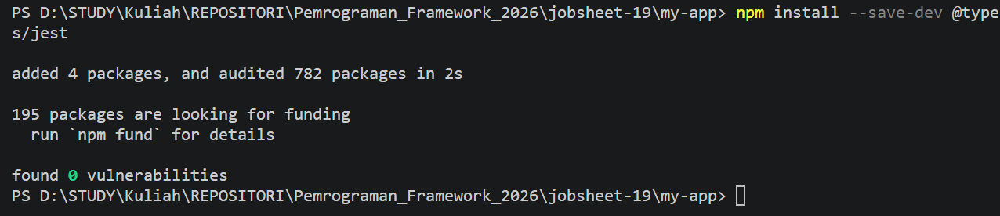


2. Update Konfigurasi tsconfig.json
```tsx
{
  "compilerOptions": {
    "types": ["node", "jest"] 
  }
}
```

---

### 3️⃣ Menjalankan Testing

```bash
npm run test
```

Hasil:

```text
PASS about.spec.tsx
```

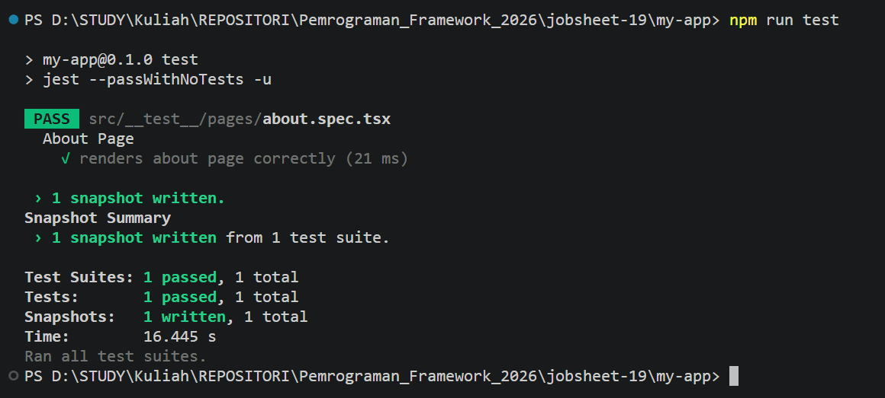

---

## Praktikum 4 – Coverage Report

### 1️⃣ Menjalankan Coverage

```bash
npm run test:coverage
```

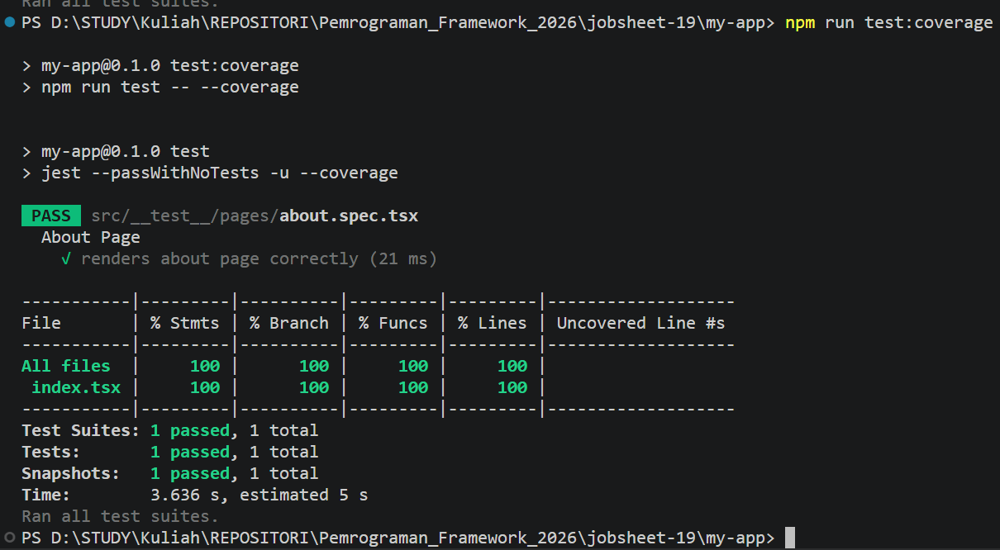

---

### 2️⃣ Hasil

Akan muncul folder:

```text
coverage/
```

Buka:

```text
coverage/lcov-report/index.html
```

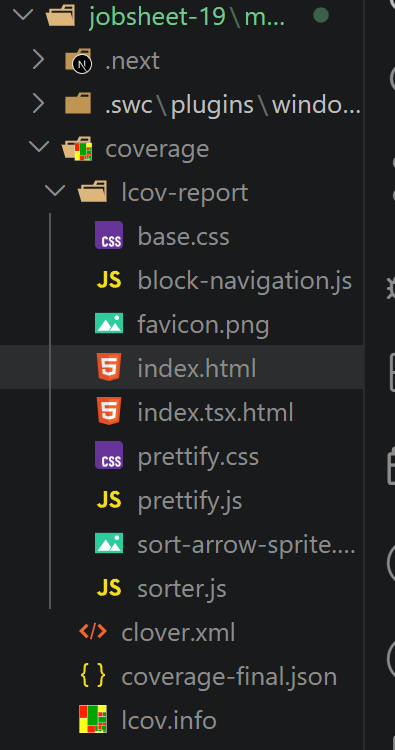

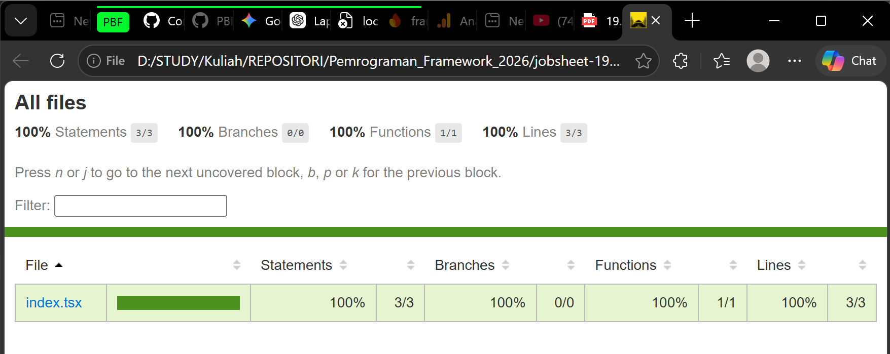

---

## Praktikum 5 – Konfigurasi Coverage Lengkap

### 1️⃣ Modifikasi jest.config.mjs

Tambahkan:

```js
import nextJest from 'next/jest.js'

const createJestConfig = nextJest({
  dir: './',
})

const config = {
  testEnvironment: "jsdom",
  modulePaths: ['<rootDir>/src/'],
  collectCoverage: true,
  collectCoverageFrom: [
    '**/*.{ts,tsx}',
    '**/*.d.ts',
    '!**/node_modules/**',
    '!**/.next/**',
    '!**/coverage/**',
    '!**/jest.config.mjs',
    '!**/next.config.mjs',
    '!**/types/**',
    '!**/views/**',
    '!**/pages/api/**'
  ],
}

export default createJestConfig(config)
```

---

### 2️⃣ Jalankan Ulang

```bash
npm run test:coverage
```

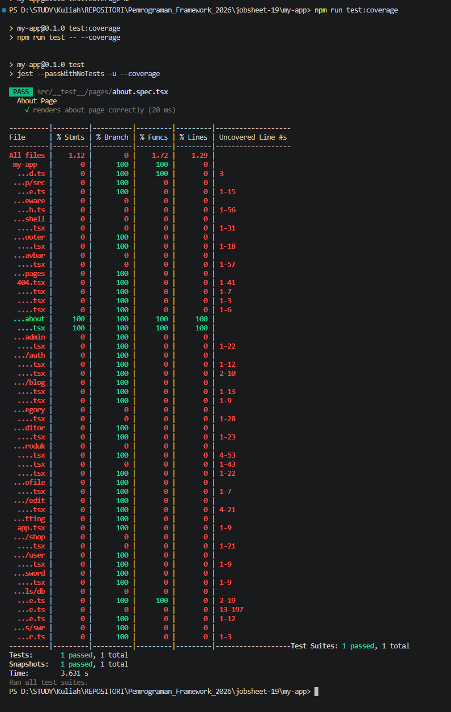

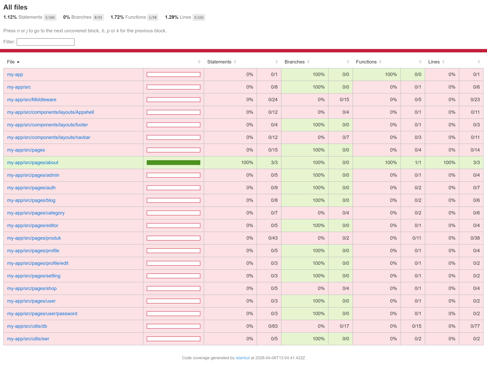

---

## Praktikum 6 – Testing dengan getByTestId

### 1️⃣ Modifikasi Halaman About

Tambahkan:

```tsx
<h1 data-testid="title">About Page</h1>
```

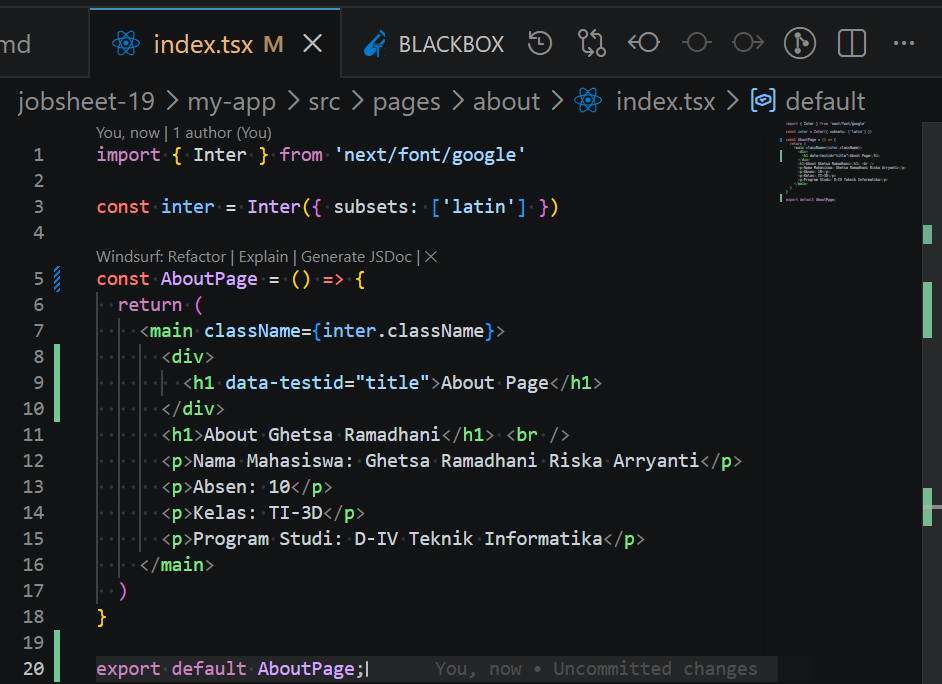

---

### 2️⃣ Update Testing

```tsx
import { render, screen } from "@testing-library/react"
import AboutPage from "@/pages/about"

describe("About Page", () => {
  it("renders about page correctly", () => {
    const page = render(<AboutPage />)
    expect(screen.getByTestId("title").textContent).toBe("About Page")
    expect(page).toMatchSnapshot()
  })
})
```

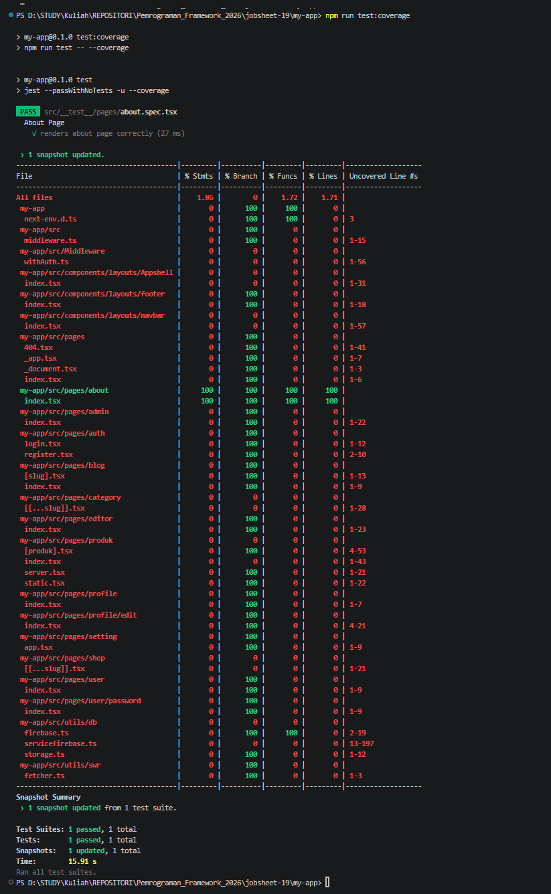

---

### 3️⃣ Pengujian Error

Jika diubah menjadi:

```tsx
toBe("About")
```

Hasil:

```text
FAIL
Expected: "About"
Received: "About Page"
```

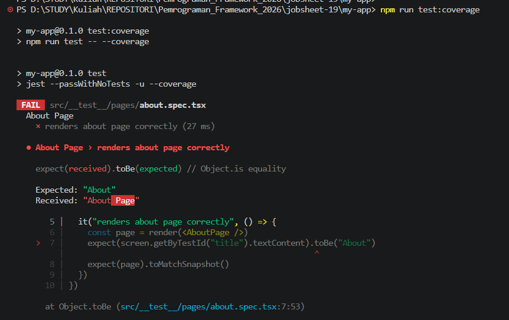

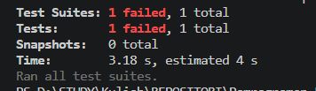

---

## Praktikum 7 – Testing Page dengan Router (Mocking)

### 1️⃣ Membuat File Testing Product

```js
import { render, screen } from "@testing-library/react"
import TampilanProduk from "@/pages/produk"

describe("Product Page", () => {
  it("renders product page correctly", () => {
    const page = render(<TampilanProduk />)
    expect(screen.getByTestId("title").textContent).toBe("Product Page")
    expect(page).toMatchSnapshot()
  })
})
```


---

### 2️⃣ Error yang Terjadi

```text
NextRouter was not mounted
```

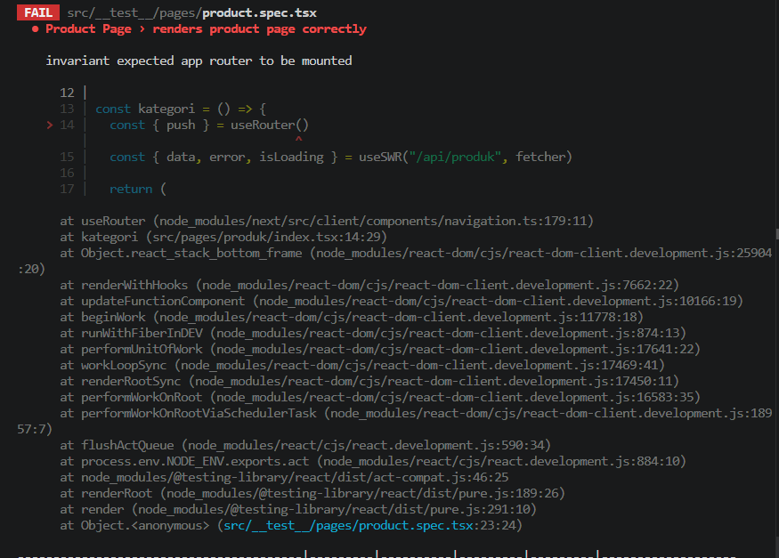

---

### 3️⃣ Solusi Mock Router

Tambahkan kode berikut:

```tsx
jest.mock("next/router", () => ({
  useRouter() {
    return {
      push: jest.fn(),
      prefetch: jest.fn(),
    };
  },
}));
```

---

## Praktikum 8 – Menangani Undefined Data

### 1️⃣ Error

```text
Cannot read properties of undefined
```

---

### 2️⃣ Perbaikan pada Komponen

Contoh:

```tsx
{data && data.name}
```

atau

```tsx
data?.name
```

---

### 3️⃣ Jalankan Ulang

```bash
npm run test:coverage
```

---

## Analisis Coverage

Contoh hasil:

| Metric     | Hasil |
| ---------- | ----- |
| Statements | 85%   |
| Branch     | 60%   |
| Functions  | 90%   |
| Lines      | 88%   |

Catatan:

* Branch paling sulit karena harus menguji kondisi if/else

---

# D. Pengujian

## Uji 1 – Snapshot Test

Hasil:

* Testing berhasil (PASS)
* Snapshot tersimpan

---

## Uji 2 – getByTestId

Hasil:

* Data sesuai → PASS
* Data salah → FAIL

---

## Uji 3 – Mocking Router

Hasil:

* Error NextRouter berhasil diatasi
* Testing berjalan normal

---

## Uji 4 – Coverage

Hasil:

* Coverage berhasil ditampilkan
* Masih perlu peningkatan jika < 80%

---

# E. Struktur Testing

Struktur final:

```text
src/__test__/
├── pages
│   ├── about.spec.tsx
│   └── product.spec.tsx
└── components
```

---

# F. Tugas Praktikum

1. Membuat unit test untuk:

   * Halaman Product
   * 1 Komponen

2. Menggunakan:

   * Snapshot test
   * toBe()
   * getByTestId()

3. Coverage minimal 50%

4. Mocking router

5. Dokumentasi hasil coverage

---

# G. Pertanyaan Analisis

### 1. Mengapa unit testing penting sebelum production?

Karena dapat mendeteksi bug lebih awal dan memastikan aplikasi stabil sebelum digunakan oleh user.

### 2. Mengapa branch coverage sulit mencapai 100%?

Karena harus menguji semua kemungkinan kondisi (if/else) yang jumlahnya bisa sangat banyak.

### 3. Apa itu mocking?

Mocking adalah teknik untuk meniru fungsi atau modul tertentu agar testing tetap berjalan tanpa dependensi asli.

### 4. Kapan snapshot test digunakan?

Digunakan untuk memastikan tampilan UI tidak berubah secara tidak sengaja.

### 5. Apakah semua file harus dites?

Tidak semua, tetapi Praktikum penting (critical feature) wajib dites.

---

# H. Output yang Diharapkan

Mahasiswa menghasilkan:

* Jest terkonfigurasi
* Testing berjalan
* Snapshot test berhasil
* getByTestId berjalan
* Mocking router berhasil
* Coverage report muncul
* Error dapat dianalisis

---

# I. Kesimpulan

Pada praktikum ini telah dipelajari:

* Instalasi dan konfigurasi Jest pada Next.js
* Penggunaan React Testing Library
* Pembuatan unit test pada halaman
* Penggunaan snapshot dan getByTestId
* Pembuatan coverage report
* Teknik mocking pada Next Router
* Penanganan error saat testing

Unit testing sangat penting dalam pengembangan aplikasi modern karena membantu menjaga kualitas kode, mendeteksi bug lebih awal, dan memastikan aplikasi siap untuk production.

---

Kalau mau, aku bisa lanjut bantu **buatkan isi kode real (About, Product, Component + test lengkap biar tinggal jalan)** atau **sesuaikan dengan project kamu sekarang**.
