# PEMROGRAMAN BERBASIS FRAMEWORK

## JOBSHEET 02

### Routing & Layouting pada Next.js (Pages Router)

------------------------------------------------------------------------

## 👤 Identitas Mahasiswa

-   **Nama:** Ghetsa Ramadhani Riska A.
-   **Kelas:** TI-3D
-   **No. Absen:** 11
-   **NIM:** 2341720004
-   **Program Studi:** Teknik Informatika
-   **Jurusan:** Teknologi Informasi
-   **Politeknik Negeri Malang**
-   **Tahun:** 2026

------------------------------------------------------------------------

# A. Tujuan Praktikum

-   Memahami konsep Pages Router pada Next.js
-   Membuat routing statis berbasis file dan folder
-   Mengimplementasikan nested routing
-   Mengimplementasikan dynamic routing menggunakan parameter URL
-   Membuat layout global menggunakan komponen layout (App Shell)

------------------------------------------------------------------------

# B. Tools & Persiapan

-   Node.js (minimal v16)
-   NPM / Yarn / PNPM
-   Code Editor (VS Code disarankan)
-   Browser (Chrome / Firefox)
-   Project Next.js (TypeScript)

``` bash
npx create-next-app@latest next-routing
cd next-routing
npm run dev
```

------------------------------------------------------------------------

# C. Dasar Konsep (Ringkas)

-   `pages/` → otomatis menjadi routing
-   `index.tsx` → root route (`/`)
-   Folder di dalam `pages/` → nested route
-   File `[param].tsx` → dynamic routing
-   `pages/_app.tsx` → entry point global aplikasi

------------------------------------------------------------------------

# D. Langkah Kerja Praktikum

## 1️⃣ Routing Dasar (Static Routing)

**Struktur Awal**

    pages/
     └── index.tsx

Tambahkan halaman `about.tsx` lalu uji di browser:

    http://localhost:3001/about

<br>

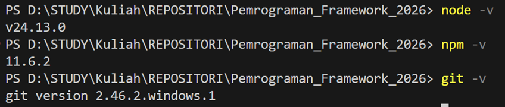

------------------------------------------------------------------------

## 2️⃣ Routing Menggunakan Folder

Rapikan struktur:
<br>

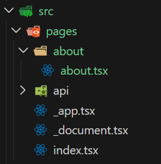 

    pages/
     └── about/
         └── index.tsx

Akses:

    /about

<br>


------------------------------------------------------------------------

## 3️⃣ Nested Routing

**Struktur Awal**

    pages/
     └── setting/
         ├── user.tsx
         └── app.tsx

Modifikasi kode:
-	user.tsx
<br>


-	app.tsx

<br>


Akses:

- /setting/user 
<br>


- /setting/app
<br>

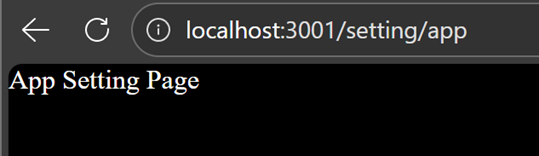

Nested lebih dalam:

<br>


    pages/
     └── setting/
     └── user/
          └── password/
          └── index.tsx

Akses:

    /user/password

<br>


------------------------------------------------------------------------

## 4️⃣ Dynamic Routing

Struktur:

    pages/
     └── produk/
         ├── index.tsx
         └── [id].tsx

<br>

•	Modifikasi index.tsx
•	Modifikasi [id].tsx
Buka browser http://localhost:3000/produk/sepatu tambahkan segment sepatu

<br>


 
•	Cek menggunakan console.log

<br>


 
•	Modifikasi [id].tsx agar dapat mengambil nilai dari id

<br>

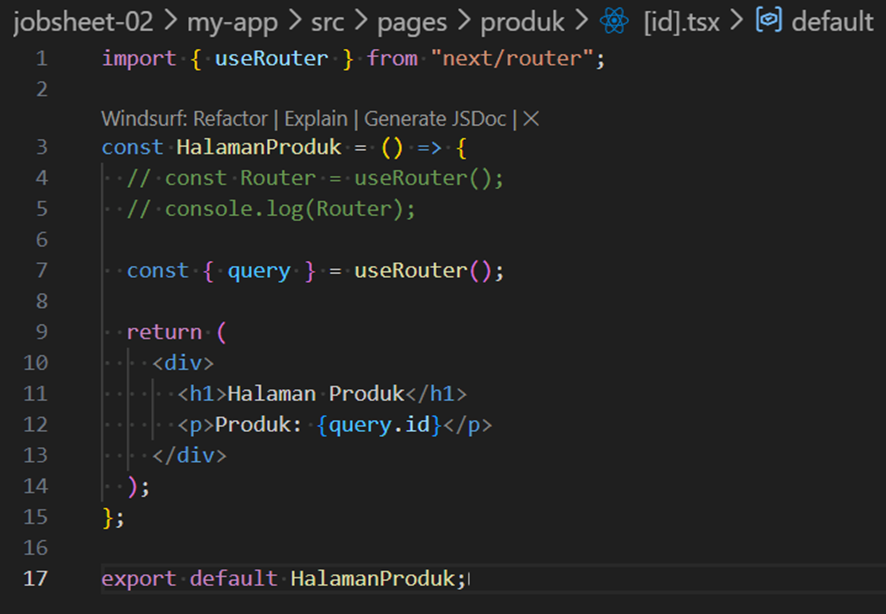
 


Contoh akses:

- /produk/sepatu

<br>

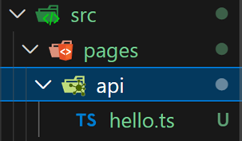

- /produk/sepatu-baru

<br>


- /produk/baju

<br>

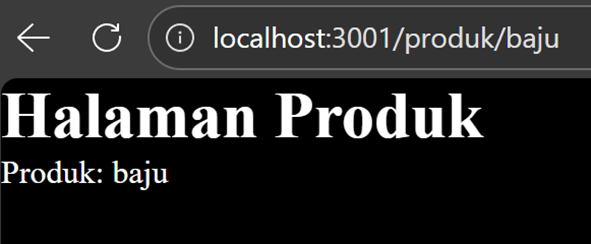


Parameter `id` ditangkap menggunakan `useRouter()`.

------------------------------------------------------------------------

## 5️⃣ Membuat Komponen Navbar

Struktur:

    src/
     └── components/
         └── layouts/
             └── navbar/
                 └── index.tsx

<br>


Modifikasi navbar/index.tsx


Modifikasi _app.tsx 


<br>
Tambahkan style di `globals.css` dan import navbar ke halaman.


<br>


Jalankan di browser 

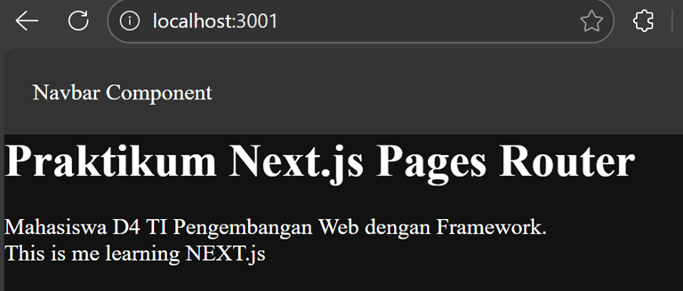


------------------------------------------------------------------------

## 6️⃣ Membuat Layout Global (App Shell)

Buat komponen `AppShell` yang membungkus:

-   Navbar (tetap)
-   `{children}` (konten dinamis)
-   Footer

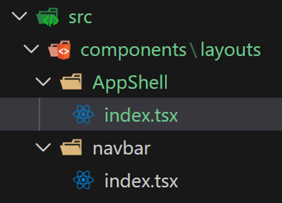

Modifikasi index.tsx pada AppShell
<br>


------------------------------------------------------------------------

## 7️⃣ Implementasi Layout di `_app.tsx`

Modifikasi `_app.tsx` agar semua halaman dibungkus oleh `AppShell`.


Hasil: 
- Navbar muncul di semua halaman
- Footer muncul di semua halaman

------------------------------------------------------------------------

# E. Tugas Praktikum

## 📝 Tugas 1 -- Routing

-   Buat halaman `/profile`
-   Buat halaman `/profile/edit`
-   Pastikan routing berjalan tanpa error

Jawaban:
- Kode:
  - \profile\index.tsx
 
    

  - \profile\edit\index.tsx
    
    
 
- Struktur:
 
  

- Output:

  
  


------------------------------------------------------------------------

## 📝 Tugas 2 -- Dynamic Routing

-   Buat routing `/blog/[slug]`
-   Tampilkan nilai slug di halaman

Jawaban:
- Kode:
  - \blog\index.tsx

    
 
  - \blog/[slug].tsx

    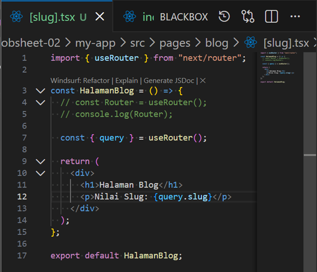
 
- Struktur:

  
 
- Output:

  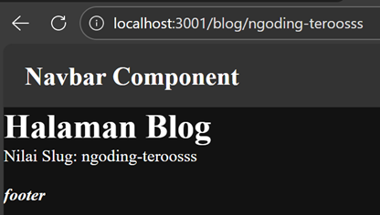
  


------------------------------------------------------------------------

## 📝 Tugas 3 -- Layout

-   Tambahkan Footer pada AppShell
-   Pastikan Footer tampil di semua halaman

Jawaban:
- Kode:
  - \AppShell\index.tsx

    
 
  - \footer\index.tsx

    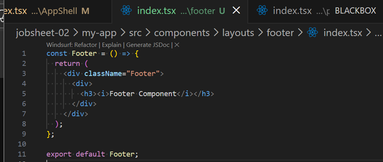
 
  - \globals.css

    


- Struktur:

  
 
- Output:

  
  


------------------------------------------------------------------------

# F. Pertanyaan Refleksi

### 1. Apa perbedaan routing berbasis file dan routing manual?

Routing berbasis file otomatis dibuat berdasarkan struktur folder dan
nama file, sedangkan routing manual memerlukan konfigurasi eksplisit
seperti pada React Router.

### 2. Mengapa dynamic routing penting dalam aplikasi web?

Dynamic routing memungkinkan halaman dibuat berdasarkan parameter URL
sehingga cocok untuk data dinamis seperti blog, produk, atau profil.

### 3. Apa keuntungan menggunakan layout global dibanding memanggil komponen satu per satu?

Layout global membuat komponen seperti Navbar dan Footer otomatis muncul
di semua halaman sehingga lebih efisien dan mudah dikelola.

------------------------------------------------------------------------

# G. Kesimpulan

Melalui praktikum ini, mahasiswa memahami konsep routing statis, nested
routing, dynamic routing, serta implementasi layout global pada Next.js
menggunakan Pages Router.

Next.js mempermudah pengelolaan routing tanpa konfigurasi manual dan
mendukung pengembangan aplikasi web yang lebih terstruktur.
